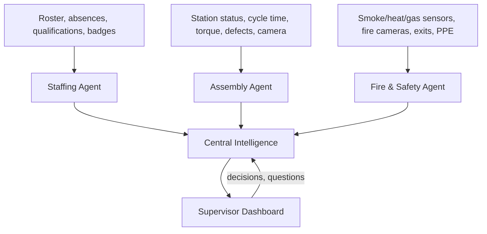

# MVP Plan: Central Factory Intelligence

Tesla hackathon, Giga Berlin. Theme: *Sustainably increase efficiency through AI.*

## Goal

A central AI system for the whole factory. The MVP covers three functions:
**Staffing**, **General Assembly Line**, **Fire & Safety**.

- Three specialised agents watch their function's data (sensors, cameras, rosters) and detect problems.
- One central agent combines their findings, ranks issues, matches people to problems and recommends actions.
- A supervisor dashboard shows only what matters, with notifications, a chat copilot and one-tap actions.
- Humans make every decision. Every recommendation and decision is logged (oversight).



## Decisions

| Topic | Decision |
|---|---|
| Timeline | 1 week+ |
| Vision | Pretrained YOLO for fire/smoke and PPE + our own visual QC model for assembly defects |
| Stack | Python, FastAPI, SQLite, asyncio event bus; React + Tailwind front end; WebSocket for live updates |
| LLM | Claude API: Sonnet 5 (central agent, chat), Haiku 4.5 (per-agent summaries, translation) |
| Data | Synthetic factory data + public image/video datasets. In production each agent is trained on the plant's own data; the architecture stays the same |

## Specialised agents

All agents emit the same event format:

```json
{
  "id": "evt_0142",
  "agent": "assembly",
  "time": "2026-10-01T08:31:00",
  "zone": "B",
  "station": "12",
  "type": "predicted_tool_failure",
  "severity": "high",
  "confidence": 0.78,
  "evidence": ["torque variance +9% over 2h", "4 micro-stops in 30 min"],
  "suggested_action": "swap tool at next break"
}
```

### Staffing agent
- **Inputs:** shift roster, absences, qualification matrix (level per person per station), certificate expiry, badge-in per zone, hours worked
- **Detects:** uncovered stations; untrained person at a station; expiring qualifications; working-time limits (max 10h/day, breaks after 6h); fire warden and first-aider coverage per zone below minimum
- **Does:** ranks replacements (qualified + available + nearby + within hours)
- **Built with:** rules + matching algorithm; LLM for explanations

### General Assembly agent
- **Inputs:** station status (running / stopped / starved / blocked), cycle time vs takt, output vs plan, torque data, part stock at stations, camera images
- **Detects:** stops and slowdowns; real vs noise output drops; defect patterns per station (visual QC model); predicted tool failure from drift; parts running out
- **Built with:** statistics (change-point detection), anomaly detection, our visual QC model; LLM summaries

### Fire & Safety agent
- **Inputs:** smoke, heat and gas sensors; camera feeds; battery-station temperature; emergency exit cameras
- **Detects:** fire/smoke (camera + sensor); battery overheating (thermal runaway risk at the battery fitting station); blocked emergency exits; missing PPE in a zone; near misses
- **Rules (hard-coded, not LLM):** safety risk → recommend stopping the zone; confirmed fire → emergency mode
- **Built with:** pretrained YOLO (fire/smoke, PPE), sensor thresholds and trends

## Central intelligence

1. **Merge** related events (same zone and time window) into one incident.
2. **Rank** incidents: safety first (hard rule) → risk of spreading → line impact (cars lost per minute) → confidence → time left.
3. **Match people to problems:** available, qualified, closest, within working-time limits.
4. **Recommend** an action: keep running / slow / reroute / stop, plus who to send. The supervisor decides.
5. **Track until closed:** escalation acknowledged, fix done, area back on schedule.

### Cross-function scenarios (must all work)

| Trigger | Agents | Central output |
|---|---|---|
| Torque tool fails at station 12 | Assembly → Staffing | Free maintenance tech named; qualified operator from a station with buffer moved to cover rework |
| Smoke at battery station 18 | Safety → Assembly → Staffing | Stop zone C; headcount and fire wardens in zone C; slow upstream zone B |
| 3 absences at shift start | Staffing → Safety | Zone B has no fire warden; suggest moving one from zone A |
| Defects rise at station 9 with a new operator | Assembly + Staffing | Tool data normal → likely method; pair trainee with a qualified buddy |
| Overtime planned to catch up | Staffing + Safety | Flags people who would exceed 10h; proposes alternatives |

## Dashboard

### Must have
1. **Priority inbox:** max 3 active incidents, recommendation, Accept / Change / Dismiss, counter of signals held back
2. **Notifications:** critical (sound + banner), warning, info; tracked until acknowledged
3. **Live floor map:** zones and stations coloured by status, people per zone, sensor alerts
4. **Chat copilot:** plain-language questions answered from live data with sources; proposes actions that run only after confirmation
5. **Staffing board:** who is where, qualification level, gaps, suggested swaps

### Should have
6. **Emergency mode:** evacuation view with people per zone, missing check-ins, fire wardens, exits, assembly points
7. **Shift KPIs:** output vs plan, takt, defects, downtime, open safety issues
8. **Auto shift handover:** AI draft from the shift's events; supervisor edits and sends
9. **What-if check:** effect of a staffing move on output, qualifications and safety coverage
10. **Decision record / oversight:** all recommendations, decisions, outcomes; override rate; works council view (process data only, no individual assessment)

### Nice to have
11. Voice input for chat
12. Multilingual (German / English / Polish)
13. Impact panel: downtime and scrap avoided, energy saved

## Architecture

```
Simulator (scripted scenario + background noise, adjustable speed)
   │
   ▼
Event bus (asyncio)
   ├─▶ Staffing agent ─┐
   ├─▶ Assembly agent ─┼─▶ Central agent ─▶ State store (SQLite)
   └─▶ Safety agent  ──┘          │
                                  ▼
               FastAPI (REST + WebSocket)
                                  ▼
               React dashboard
```

### Chat copilot tools (Claude tool use)
- `get_incidents`, `get_station_status`, `get_zone_people`, `get_staff(filter)`, `get_qualifications(person|station)`
- `get_kpis(time_range)`, `get_event_history(filter)`, `get_sensor_readings(zone)`
- `propose_assignment(person, station)`, `propose_action(incident, action)`: return a proposal; executed only after the supervisor confirms in the UI

### Folder structure
```
backend/
  simulator/     factory model, synthetic data, scripted scenario
  agents/        staffing.py, assembly.py, safety.py
  central/       fusion, ranking, matching, recommendations
  vision/        visual QC wrapper, fire/smoke + PPE detectors
  api/           FastAPI routes + WebSocket
  llm/           Claude client, chat tools, prompts
frontend/        React dashboard
data/            layout, roster, qualifications, sample images/videos
```

## Synthetic data
- **Layout:** 1 assembly section, 4 zones (A–D), 24 stations (6 per zone), exits, sensor positions, battery fitting station S18 in zone C
- **People:** 35 workers (24 operators, 8 floaters, 3 maintenance), qualification level per station (0 = untrained, 1 = trainee, 2 = qualified, 3 = trainer), fire warden / first aider roles, roster, absences
- **Streams:** cycle times, torque, stock levels, smoke/heat/gas, badge events
- **Vision:** public fire/smoke clips (e.g. D-Fire dataset), PPE images, defect images for the visual QC model

## Demo story (~4 min)

1. **06:00** 3 absences → station 12 uncovered and zone B without a fire warden → two swaps suggested → accepted
2. **08:30** Torque drift at station 12 → predicted tool failure → swap scheduled at the break, free maintenance tech named
3. **09:40** Visual QC flags defects at station 9 → merged with "trainee at station 9" → buddy pairing suggested
4. **10:15** Camera detects smoke at battery station 18 → emergency mode: zone C stopped, headcount, fire wardens alerted, zone B slowed
5. **10:25** All clear → restart plan: who returns where, catch-up needed
6. **Chat** "Summarise the shift for the handover" / "Which station caused the most downtime?"
7. **Oversight view** every decision logged, humans made every call

## Schedule (1 week)

| Day | Backend / AI | Frontend | Vision |
|---|---|---|---|
| 1 | Factory model, synthetic data, event format, simulator skeleton | Project setup, layout, design system | Collect datasets; test pretrained fire/smoke + PPE models |
| 2 | Staffing agent (rules, matching); Assembly agent (stats, anomalies) | Floor map, notifications (mock data) | Wrap visual QC model as an event-emitting service |
| 3 | Safety agent + stop rules; central agent: merge + rank | Priority inbox, staffing board | Fire/smoke + PPE services on sample clips |
| 4 | Central agent: people matching, recommendations, escalation tracking; WebSocket | Connect to live backend | Connect vision events to agents |
| 5 | Chat copilot (tools, confirmations); decision record | Chat panel, emergency mode | Confidence + "unsure" handling |
| 6 | Handover, what-if, impact numbers | KPIs, oversight view, handover, what-if | Voice input, multilingual |
| 7 | Full scripted run, bug fixes | Polish, demo rehearsal | Pitch slides mapped to Tesla's 9 topics |

**Cut order if behind:** what-if → handover → voice/multilingual → live vision (use pre-recorded detections).
**Never cut:** cross-function scenarios, priority inbox, chat copilot.

## Status

MVP built: see [README.md](README.md) for how to run it and the demo script. Backend 148 tests, frontend 39 tests.

## Open items
- Which inspection does our visual QC model do, and where is its code? (Decides the defect story at station 9.)
- Confirm with organisers what "Oversight" means and whether the 9 topics on the slide are the judging criteria.
- Anthropic API key for the team.
