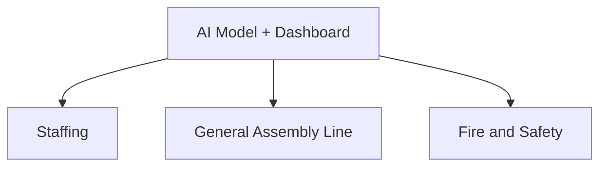
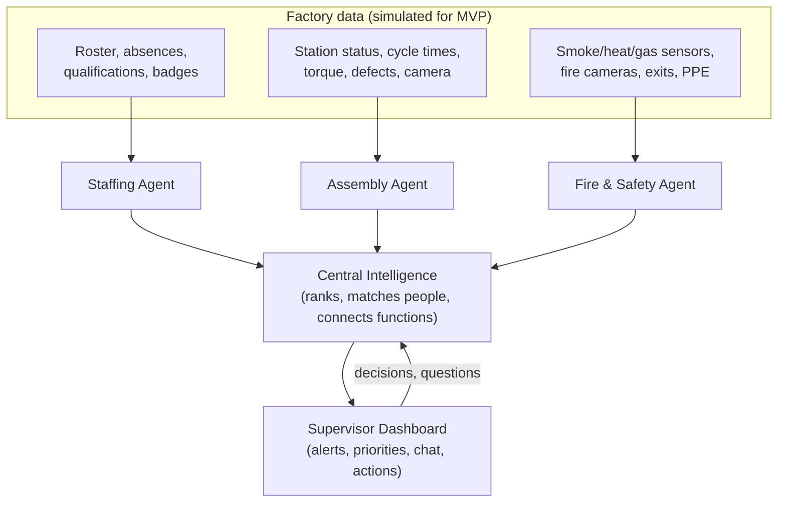

# Conversation log

Session `bc180932-0035-4824-ac13-89f46220ff6a` · Tesla Giga Berlin hackathon · 25–26 Sep 2026 (times in UTC)

Your messages and Claude's replies verbatim. Tool calls are listed as one line each; tool output, injected reference material and internal reasoning are omitted. See `summary.md` for the short version.

---

## 1. You (2026-09-25 17:46)

> I'm participating in a hackathon where I have to build a product using AI that can make a day to day function of a production engineer or a production supervisor easier, more efficient. The role definition for both roles are given here: roles.
> This hackathon is from Tesla and the product is needed for brandenburg giga factory.
> I need to find out what exact problems do these supervisor and engineers face in day to day life that I can solve using AIs.

<details><summary>Tool calls (2)</summary>

- `Bash`: List files in the project directory
- `Bash`: Read both role definition files

</details>

**Claude:**

I read both role files. They look written on purpose: almost every sentence points to a real friction point. Below are the problems I'd go after, drawn from the files plus what's publicly known about Giga Berlin (Grünheide).

#### The key insight: the gap between the two roles

Put these two lines side by side:

- **Supervisor:** the handover "includes corrections that are not written down yet."
- **Engineer:** "The change must be approved before the line uses it. If that step is skipped, a bad change becomes the way everyone works."

This is the central tension. Supervisors fix things on the floor that never make it into the official method. Engineers own that method but only learn about floor reality through walks, meetings and phone calls. Every shift, knowledge falls into this gap: workarounds get lost, or they become unofficial standards nobody approved. A product that connects the two roles is more interesting than one that serves only one of them.

#### Production Supervisor: pain points

| # | Problem (from the role file) | Why it hurts | AI angle |
|---|---|---|---|
| S1 | **Who stands where**: "check the person is trained… place a trained person there when someone is absent" | Giga Berlin has had very high sick-leave rates. German press in 2024 reported spikes around 15–17%, so reshuffling at shift start happens daily and is usually done from memory or a paper/Excel qualification matrix | Staffing assistant: absences plus qualification matrix plus certification expiry gives a suggested station assignment in seconds. It flags any untrained or expired placement as a safety or quality risk |
| S2 | **Triage**: "several problems often look equally urgent… the call cannot wait" | Mental load. The role file already contains the decision rules: safety stops the area, a spreading quality issue stops it, a contained defect keeps running | Triage copilot that applies those rules and shows the effect on the sections before and after this one. Keep it advisory; the supervisor decides |
| S3 | **Escalations that aren't closed**: "contact is finished only when the other person confirms they are acting," all by phone or radio | Radio calls leave no record. "I called maintenance 20 minutes ago, did anyone confirm?" | Voice-logged escalations with an acknowledgement timer and automatic re-escalation. Gives a live list of open requests |
| S4 | **Shift handover** | Verbal, rushed, and unwritten corrections get lost | Voice-first handover: speech to structured report, in multiple languages. Unwritten corrections are pulled out and routed to the engineer (this closes the gap above) |
| S5 | **Recovery after a machine is back**: bring the area back onto schedule | Working out how to catch up while the line keeps moving | Recovery-plan suggestions (overtime, rebalancing, buffers) |

#### Production Engineer: pain points

| # | Problem | AI angle |
|---|---|---|
| E1 | **"Decide if a drop is real"**: production numbers jump around | Statistical process control / change-point detection on output, scrap and cycle time. Separates noise from real change and gives a confidence level |
| E2 | **Root cause across people, method, station layout and machine**: "tell the causes apart before choosing a fix" | Correlate MES output, machine (PLC) alarms, quality defect data, staffing changes and recent method changes on one timeline. For example: "the drop started the shift after work instruction v4 went live, only on shifts where station 12 had a new operator" |
| E3 | **What to work on first** | Rank problems by lost units, € and safety impact |
| E4 | **Change validation**: is it safe, does the work still fit the allowed time (takt), write the instruction, get approval, update it for the next shift | LLM drafts the work instruction from engineer notes or photos, checks the steps against cycle time, runs the approval workflow with versions, and publishes it in German, English, Polish and other languages. **This is heavy, hated paperwork, which makes it a good AI target** |
| E5 | **Preventive-maintenance intervals** | Predictive maintenance from alarm and failure history (crowded space, lots of hackathon teams will do this) |
| E6 | **Telling planning how much the line can still produce** | Capacity forecast from current availability, quality rate and staffing |
| E7 | **Quality hold: does a product wait for a check or move on** | Risk scoring from defect history |

#### Constraints at Giga Berlin that will make or break a pitch

1. **Works council (Betriebsrat) co-determination.** Under German works-council law (§87(1) no. 6 BetrVG), any system *able* to monitor employee performance needs works-council approval. Don't pitch anything that scores individual workers. Frame it as "supporting the supervisor and engineer, aggregated by process." The judges will notice.
2. **GDPR plus the EU AI Act.** AI used for work allocation or monitoring of workers is listed as *high-risk* in the AI Act (Annex III). The staffing assistant (S1) needs a human decision at every step, and it should be described as a qualification check, not an optimiser of people.
3. **Multilingual workforce.** Many nationalities work there, with a large Polish commuter group. Voice or text interfaces must handle mixed languages.
4. **The shop floor.** It's noisy, hands are busy or gloved, and people move around. Voice or radio input and glanceable phone or tablet screens beat dashboards.
5. **A young plant still ramping up.** Methods change often, so the problem of instructions going out of date (E4) is sharper than at an older plant.

#### My recommendation

Build the **"shift loop"**, a closed loop across both roles:

1. **The supervisor talks** (radio or phone, any language) → escalations are logged, acknowledgements tracked, and the handover is written automatically (S3 + S4).
2. **Unwritten corrections and repeat problems** are pulled out automatically and sent to the engineer as candidate changes, with a note on whether the problem is real (E1).
3. **The engineer approves** → AI drafts the updated work instruction in several languages, checks it against the allowed time, and pushes it to the next shift's supervisor (E4).

This covers the gap the organisers built into the role files, avoids the predictive-maintenance crowd, is demo-able with synthetic data, and fits works-council rules because it monitors processes, not people. If you need a narrower scope, **S1 (qualification-aware staffing)** is the most tangible single feature and is directly tied to the absenteeism problem.

#### Validate before building

If you can talk to anyone from the plant or a mentor, ask:
- "Walk me through the first 30 minutes of your shift. What do you look at, and where?" (tests S1)
- "The last time a radio escalation fell through, what happened?" (tests S3)
- "How does a floor workaround become an official work instruction today, and how long does it take?" (tests the gap and E4)
- "When output drops, how long until you know whether it's real, and what data do you pull?" (tests E1 and E2)
- "What systems do you already use (MES, CMMS, qualification matrix)? What can we realistically plug into?"

Want me to turn this into a one-page problem brief for your team, or start scoping the MVP and synthetic data set for the shift loop?

---

## 2. You (2026-09-25 18:00)

> we wanted to build a multi agent system with each agent handling one pain point connected together to communicate when an issue happens and predict when failures happen and that is given to the supervisor because a supervisor handler many functions so the data they see is immense in volume.

**Claude:**

Good direction. The strongest version of this idea is **not** "many agents." It is **one supervisor who sees 3 things instead of 300**. Judges will ask why you need several agents, and the honest answer is that each data stream (machines, quality, people, escalations) needs its own specialist. One layer then combines what they find, so the supervisor gets decisions instead of raw data. Build the pitch around that combining layer.

#### Architecture

```
 DATA SOURCES (simulated)        SPECIALIST AGENTS                 ORCHESTRATOR            HUMAN
 ───────────────────────        ─────────────────                 ────────────            ─────
 Machine alarms, sensors ──▶ ① Machine Health  (predicts failures) ─┐
 Output / cycle time     ──▶ ② Line Performance ("is the drop real?")─┤
 Defect / inspection     ──▶ ③ Quality (spread risk, containment)  ─┼─▶ ⑥ Triage Copilot ──▶ Supervisor
 Absences, training list ──▶ ④ Staffing (who is trained for what) ─┤   (merge, rank,       tablet/radio
 Radio/phone calls       ──▶ ⑤ Escalation (was it acknowledged?)   ─┘    recommend)
                                          ▲                               │
                                          └──── asks for context ─────────┤
                                                                           ▼
                                                            ⑦ Handover agent ──▶ next supervisor
                                                               (+ repeat issues ──▶ engineer)
```

| Agent | Watches | Produces | Built with |
|---|---|---|---|
| ① Machine Health | Machine alarm codes, micro-stops, cycle-time and sensor drift | "Station 14 screwdriver: 70% chance of failure within 2h" | **Classic ML/statistics, not an LLM** (trend and anomaly models) |
| ② Line Performance | Output per hour, takt adherence | "Drop is real (confidence 0.9), started 09:40" vs. "noise" | Statistical change detection |
| ③ Quality | Defect reports | "Defect X is repeating on 4 cars. Risk of spread → stop" | Rules plus a small model |
| ④ Staffing | Absences, qualification matrix | "Station 14 has a person trained <2 weeks ago" / reassignment options | Rules (keep a human in charge) |
| ⑤ Escalation | Logged calls to maintenance, quality and others | "Maintenance hasn't confirmed after 10 min → re-escalate?" | Timers plus an LLM for voice-to-text |
| ⑥ **Triage Copilot** | All agent events | Top 3 merged incidents with a recommended action | **LLM** (Claude) using the role file's decision rules |
| ⑦ Handover | Shift event log | Written handover, unwritten corrections, repeat issues for the engineer | LLM |

#### Design rules that will make it good

1. **Agents publish structured events, not chat.** Every agent emits the same format onto a shared event bus:
   ```json
   {"agent":"machine_health","station":"14","type":"predicted_failure",
    "severity":"high","confidence":0.7,"eta_min":120,
    "evidence":["torque drift +8% over 3h","micro-stops x4"],
    "suggested_action":"call maintenance before break"}
   ```
   This keeps the system debuggable. Use LLMs only where reasoning or language is needed (⑤ voice, ⑥ triage, ⑦ handover).

2. **The orchestrator merges related alerts, it doesn't just list them.** The key demo moment: a machine drift at station 14 (①), rising defects at station 14 (③) and a new operator at station 14 (④) become **one incident** with a likely cause, not three separate alerts. The engineer role file asks for exactly this: tell the causes apart.

3. **Limit how much the supervisor sees.** A hard cap (e.g. at most 3 active items). Everything else is logged but held back. Put a number on it in the pitch: "412 raw signals this shift → 9 supervisor decisions."

4. **Hard-code the supervisor's rules as a safety layer, not something the LLM decides.** From the role file: safety risk → stop the area; quality problem that may spread → stop; defect already set aside → keep running. The LLM ranks and explains, and the rules can't be overridden.

5. **The agents recommend, the supervisor decides.** The role file is explicit: the supervisor decides stops. It also matters for the EU AI Act and the works council.

6. **Predict failures before they happen, then act.** Prediction from ① only counts if it leads to a scheduled fix ("fix it during the 11:30 break") instead of a stop at 12:10. Show that in the demo.

#### Demo: one scripted shift

Run a simulator that replays a synthetic shift at 60× speed:

1. **06:00** Staffing agent: 3 absences → suggests reassignments, flags one borderline qualification.
2. **08:15** Line Performance: output dips → "noise, ignore" (held back, which shows the filtering).
3. **09:40** Machine Health: torque drift at station 14 → predicted failure in ~2h.
4. **09:55** Quality: 2 loose-fastener defects at station 14 → Triage **merges** these with step 3 → "Likely tool degradation, not the operator. Recommend a planned tool swap at the 10:30 break, 100% check on fasteners until then."
5. Supervisor taps accept → Escalation agent calls maintenance → no confirmation after 10 min → reminder.
6. **14:00** Handover agent writes the report and sends "station 14 tool, 3rd time this month" to the engineer.

Show a side-by-side view: the raw signal flood vs. the supervisor's screen.

#### Risks to address before judges raise them

- **Prediction with synthetic data.** Be upfront about it. Build known wear patterns into the simulator (e.g. rising torque variance before a tool failure) and show that the model catches them. Say the real version would train on Giga Berlin's own history.
- **"Why not one agent?"** Separate data sources, separate models, separate failure modes. Specialists can be tested and replaced one at a time.
- **Monitoring workers.** The staffing agent checks *qualifications*, never performance. Only process-level data.
- **Scope.** If time is short, build ①, ③, ⑥ and ⑦ properly and fake ②, ④ and ⑤ with scripted events. The merge in ⑥ is what wins the demo.

#### Suggested stack

Python backend, an in-memory asyncio queue or Redis Streams as the event bus, scikit-learn or simple statistics for ① and ②, and Claude for ⑥ and ⑦ (Sonnet 5 for triage, Haiku 4.5 for cheap voice-to-text and classification). A tablet-sized web UI for the supervisor.

Should I scaffold this next? I'd start with the shift simulator and the event format, because every agent depends on those two.

---

## 3. You (2026-09-25 18:12)

> and these monitoring monitors from different sensors like images, temperature, audio, other sensors, so don't we need multimodal models?

**Claude:**

Yes, the data is multimodal. But you mostly don't need **multimodal LLMs** for it. Use small, specialised models for each sensor type, turn what they detect into structured events, and use a multimodal LLM only where reasoning or explanation is needed.

#### Why not send raw sensor data to a big model?

| Issue | Reality on the line |
|---|---|
| **Volume** | A camera produces ~30 frames/s and a vibration sensor thousands of readings/s. Streaming that into an LLM is too slow and far too expensive |
| **Latency** | A moving line needs detection in milliseconds to seconds, not an API round-trip |
| **Accuracy** | A small model trained on one station's images or sounds beats a general model at "is this weld abnormal?" |
| **Reliability** | The factory needs consistent, auditable outputs and has to keep working if the network drops |

#### The right split: per-sensor models, then reasoning over events

```
 RAW SIGNALS (high volume)       PER-SENSOR MODELS (fast, near the line)    EVENTS (low volume)       REASONING
 ─────────────────────────       ───────────────────────────────────────    ───────────────────       ─────────
 Camera images            ──▶ Visual anomaly / defect detection     ─┐
 Audio (motors, tools)    ──▶ Sound anomaly (spectrogram model)     ─┤
 Temperature              ──▶ Threshold + trend / drift model       ─┼─▶ {"station":14,        ──▶ Triage LLM
 Vibration                ──▶ Frequency analysis + anomaly model    ─┤    "type":"anomaly",        (merges events
 Torque, current, PLC     ──▶ Time-series anomaly / remaining life  ─┘    "confidence":0.8, ...}    by station + time)
```

Each sensor model sends out **a short event only when something is off**. The Machine Health agent you already planned becomes a set of these sensor models. The combining happens at the event level: the Triage agent sees "station 14: abnormal sound + temperature rising + torque drifting" and concludes it's one issue (probably the bearing or tool), not three.

#### Where a multimodal LLM (e.g. Claude with images) does help

These are low-volume uses where a human is involved:
- **Explaining a flagged image.** The vision model catches a defect; the LLM describes it in plain language for the supervisor ("paint run on left rear door, ~3 cm").
- **Photo from the floor.** A supervisor or operator photographs a problem, and the LLM classifies it and fills in the escalation or defect report.
- **Reading screens and documents.** A machine display showing an error code, a paper checklist, a drawing.
- **Writing work instructions from photos** of the station (the engineer's instruction-writing problem).
- **Handover and triage explanations** that cite the evidence from each sensor.

#### For the hackathon, use public datasets

You don't need Tesla's data to show this works:

| Sensor type | Dataset | Model approach |
|---|---|---|
| Images | **MVTec AD** (industrial defect images) | PatchCore / PaDiM via the `anomalib` library |
| Audio | **MIMII** / **DCASE** (normal vs. faulty machine sounds) | Autoencoder on spectrograms |
| Vibration | **CWRU** or **NASA/IMS bearing** datasets | Frequency features + anomaly model; remaining useful life for prediction |
| Temperature / torque | Synthetic, from your simulator | Trend / drift detection |

**Scope suggestion:** build **one real sensor model** (audio or vision, both demo well: you can play the faulty sound or show the heatmap on the image), simulate the others as event streams, and put your effort into how the Triage agent merges them. One live model plus a convincing merge beats four half-working ones.

**How to pitch it:** "Small models near the line watch every signal. The supervisor only hears about it once several signals point to the same problem."

Want me to scaffold the event format and the simulator, with slots for these sensor models?

---

## 4. You (2026-09-25 18:17)

> is this idea novel enough?

**Claude:**

Honestly: **the idea as stated isn't novel.** Predicting failures from sensor data plus a copilot for plant staff is a crowded area, and at a Tesla hackathon several teams will probably pitch "predictive maintenance + dashboard." But novelty of the parts matters less than **what you point it at**, and your angle has a sharp version.

#### What already exists

- **Machine health / predictive maintenance:** Augury (vibration and audio), Uptake, and features in Siemens, SAP and AWS products. This is mature.
- **Industrial copilots:** Siemens Industrial Copilot, Microsoft's factory copilot/agent offerings, Cognite's AI agents. They answer engineers' questions over plant data.
- **Frontline operations apps:** Tulip, Poka and similar (digital work instructions, checklists, shift reports).
- **Visual inspection:** Landing AI, Cognex, and in-house systems (Tesla certainly has its own).

If you pitch "agents that monitor sensors and predict failures," a judge from the factory will think "we already have that."

#### Where the gap actually is

Most tools **add** screens and alerts; nobody **decides what the supervisor should ignore.** The supervisor role file describes someone taking in several urgent-looking problems at once while the line moves. Those tools all start from machines. Your system starts from the supervisor's attention and connects machines, quality, people and communication for one section during one shift.

To make that defensible, lead with the things existing tools don't do:

1. **Attention budget as the product.** Hard cap of 3 active items. Measure success by alerts *suppressed* and decisions made, not by alerts detected. "412 signals → 9 decisions" is the headline.
2. **Linking machines with people and qualifications.** "Defects at station 14 are the tool, not the new operator," or the reverse. Machine-health tools don't know who's standing at the station; staffing tools don't know about torque drift. This merge is your most original piece.
3. **Showing the effect on the moving line.** Each recommendation shows what happens to the sections before and after this one (keep running / slow / reroute / stop, the four options in the role file). Most copilots stop at "machine X is abnormal."
4. **Closing the loop, not just alerting.** Escalation isn't done until someone acknowledges it, and repeat issues and unwritten corrections flow to the engineer as change candidates. This closes the supervisor–engineer gap from the role files, which the organisers seem to have built in on purpose.
5. **Learning from the supervisor.** Every accept/reject/override teaches the ranking what this supervisor treats as urgent. Over time, fewer false alarms.

#### How to pitch it

Don't say: *"A multi-agent system that monitors sensors and predicts failures."*

Say: *"Giga Berlin already has the data. The problem is that a supervisor can't process it while the line moves. We built the layer that turns 400 signals into the 3 decisions that matter, and makes sure each one gets closed."*

Predictive maintenance becomes one input, not the product.

#### How judges will likely score it

Hackathon judges usually weigh **problem fit, demo and feasibility** above pure novelty. You already fit the problem well (it's built from their role definitions). Put the most effort into a demo where the merge in point 2 happens live. That is the moment that feels new.

If you want to test differentiation further, a quick check of what Tesla has said publicly about its own factory software would help. I can research that, or start on the scaffold.

---

## 5. You (2026-09-25 18:21)

> another problem is on Supply Chain Management, what problems are there?

**Claude:**

Yes. Supply chain touches your idea directly: the supervisor role file names **"a missing part"** as one of the calls that changes the plan, and the engineer tells planning how much the line can produce. Giga Berlin has also been hit hard by supply problems in practice:

- **Jan–Feb 2024:** production paused for about two weeks. Red Sea shipping attacks forced ships around Africa and delayed parts from Asia.
- **March 2024:** an arson attack on a nearby power pylon stopped the plant for about a week (a power supply problem, but the same "outside event → line stops" pattern).

Split the problems into two levels: **on the factory floor** (fits your current system) and **upstream with suppliers** (a bigger, more crowded market).

#### Level 1: Material flow on the floor (supervisor / engineer relevant)

| # | Problem | What happens today | AI angle |
|---|---|---|---|
| M1 | **Parts running out at the station** | Supervisor finds out when the bin is empty or a worker calls; the line stops or cars leave with missing parts | Predict "station 22 runs out of part X in ~25 min" from usage rate, bin stock and the next delivery by tugger/AGV |
| M2 | **Wrong part or wrong sequence** | Parts arrive in the order of the cars on the line (just-in-sequence); a mismatch of variant, colour or trim means rework or a stop | Match the delivered sequence to the production sequence; flag a mismatch before it reaches the station |
| M3 | **Bad supplier batch** | A defective lot is discovered late; nobody knows quickly which cars got parts from it | Traceability: from lot number to the affected vehicle IDs → targeted containment instead of a broad stop (feeds your Quality agent) |
| M4 | **Stock the system believes exists but doesn't** | System says 200, the shelf is empty; plans are built on wrong numbers | Flag differences between expected usage and recorded stock; camera or scan checks |
| M5 | **Switching to a new part revision** | Engineering changes a part; old and new stock mix, or old stock is scrapped | Plan the changeover date against remaining stock; warn when stations still have the old revision |

#### Level 2: Upstream supply chain (planning / logistics roles)

| # | Problem | AI angle |
|---|---|---|
| U1 | **Early warning of disruptions** (shipping routes, strikes, weather, supplier insolvency, border delays with Poland) | LLM reads news, shipping and supplier data → links it to the parts list → "Supplier Y, part Z: stock covers 4 days, disruption expected to last 10" |
| U2 | **No visibility beyond direct suppliers** | Mapping the suppliers' own suppliers (who makes the chips inside a supplier's module) |
| U3 | **Chasing late deliveries** (emails, calls, costly express freight) | Agent drafts and tracks chase messages and compares express-freight cost with the cost of a line stop |
| U4 | **Schedule changes vs. part availability** | When planning changes the model or trim mix, check automatically whether the parts are there |
| U5 | **Compliance paperwork**: German Supply Chain Due Diligence Act (LkSG), EU Battery Regulation with the digital battery passport (from 2027) | LLM extracts and checks supplier documents. Heavy on documents, well suited to LLMs, less exciting to demo |

#### How this fits your system

My recommendation: **don't switch to generic supply chain software.** It's a crowded market (Kinaxis, o9, Everstream, Resilinc, Interos, SAP). Instead, **add a Material agent** to the multi-agent system:

- It covers M1–M3 and publishes the same kind of events as the other agents.
- Triage can now merge material problems with everything else. Example: "Station 22 runs out of brackets in 25 min **and** the replacement tugger route is blocked by the machine repair at station 20. Reroute the tugger now." No machine-only or logistics-only tool makes that connection.
- M3 connects to the Quality agent: supplier lot → affected cars → contain only those.
- Optionally, add U1 as an "outside world" agent feeding in slower signals ("brackets from supplier Y will be late for 3 days" → planning/engineer impact). It shows the architecture can grow without building it fully.

For the demo, one added step to the scripted shift is enough: **10:05, Material agent: "Station 22 runs out of brackets in 25 min,"** merged by Triage with the station-14 repair already in progress. That strengthens your story that one layer understands the whole section.

Should I add the Material agent to the architecture and event format when I scaffold it?

---

## 6. You (2026-09-25 18:48)

> The idea is to sustainably increase efficiency through AI.

**Claude:**

That theme fits your system well, but "sustainably" can mean three things. The strongest pitch covers all three, because judges may mean any of them.

#### 1. Lasting efficiency: stop the same problems from coming back

Most factory AI makes firefighting faster. Better alerts help today's shift, but the same tool fails again next week. For efficiency to last, **each problem must lead to a permanent fix.**

Your system already has what it needs for this, if you make it the core:

```
Detect ──▶ Decide (supervisor) ──▶ Close (escalation acknowledged) ──▶ Learn (engineer fixes root cause) ──┐
  ▲                                                                                                        │
  └──────────────────────────── fewer repeat problems next shift ──────────────────────────────────────────┘
```

- The Handover agent spots **repeat issues** ("station 14 tool, 3rd time this month") and sends them to the engineer as change candidates with the evidence attached.
- The engineer approves a fix → the work instruction or maintenance interval is updated → the next shift runs the new method.
- The ranking learns from supervisor decisions → fewer false alarms over time.

**Show it with a number that falls:** the repeat-incident rate. "Week 1: station 14 fails 3×. After the loop: 0." That is what sustainable efficiency looks like.

#### 2. Environmental: less energy, scrap and water per car

A factory wastes resources in ways your agents can already see:

| Waste | How your system reduces it |
|---|---|
| **Scrap and rework** | Early merged detection (tool drift + defects) → fewer bad cars. Each scrapped part is wasted material, energy and CO₂ |
| **Energy during stops** | When Triage knows the line is stopped or starved of parts, recommend putting robots, conveyors and heaters on standby. Cheap to add, easy to measure |
| **Compressed-air leaks** | Commonly cited as one of the largest energy losses in plants. **Leaks are detectable by sound**, so your audio model gets a second use |
| **Paint shop** (usually the most energy-intensive area of a car plant) | Fewer paint defects → fewer repaints → less energy and chemicals |
| **Water** | Especially sensitive at Grünheide. Water use was a major public issue in the plant's approval and in the 2024 local vote against the expansion. Flagging abnormal water use from process meters is a strong local signal |
| **Express freight** | Predicting part shortages earlier (Material agent) → fewer emergency truck or air deliveries |

You could add a small **Resource agent** that turns every incident into energy/CO₂/water impact, so each recommendation shows e.g. "planned tool swap saves 1 stop, ~X kWh, 2 scrapped parts."

#### 3. People: sustainable workload

The supervisor's information overload isn't only an efficiency problem. It is a stress and burnout problem, in a plant with publicly reported high sick-leave rates. The attention budget (max 3 active items) directly supports **long-term people sustainability**. It also fits the German works-council view: the system reduces load and monitors processes, not people.

#### Updated pitch

> *"Giga Berlin doesn't need more alerts. It needs problems that stay fixed. Our agents turn hundreds of sensor, quality, material and staffing signals into the three decisions a supervisor needs to make, make sure each is closed, and send repeat problems to engineering so they don't come back. The result: fewer stops, less scrap, less wasted energy and water per car, and a supervisor who isn't overloaded."*

#### Metrics to show on the demo dashboard

- **OEE** (overall equipment effectiveness: availability × speed × quality)
- **Repeat-incident rate** (the key "lasting" metric)
- **Scrap/rework per 100 cars**
- **kWh and water per car**, plus avoided express freight
- **Signals → supervisor decisions** (workload)

If "sustainable" in your hackathon brief specifically means environmental, tell me and I'll weight the pitch toward the Resource agent. Otherwise, I'd lead with lasting efficiency (#1) and use #2 and #3 as supporting benefits.

---

## 7. You (2026-09-25 18:52)

> okay, effective communication between production engineer and production supervisor?

**Claude:**

This is where I'd focus the product, because the role files show the most friction right here. The two roles depend on each other but work on different time scales, in different places, and often on different shifts.

#### Where the two roles connect (from the role files)

| Direction | What should flow |
|---|---|
| Supervisor → Engineer | "What is happening on the line now," issues from the last shift, and corrections made on the floor |
| Engineer → Supervisor | The written method (work instructions), approved changes, stop or adjustment recommendations |
| Shared decisions | The engineer **recommends** a stop; the supervisor **decides** it |

#### Where it breaks down

| # | Problem | Why it happens | Consequence |
|---|---|---|---|
| C1 | **Lossy reporting** | Supervisor reports from memory, by radio or at the morning meeting: "station 14 was acting up again" | The engineer gets a symptom without time, data or context, and has to dig it up again |
| C2 | **Night and weekend shifts are invisible** | Engineers mostly work day shift; the line runs around the clock | What happened at 03:00 reaches the engineer second- or third-hand, if at all |
| C3 | **Corrections that never get written down** | Supervisors fix things on the spot to keep the line moving | Either the knowledge is lost, or an unapproved workaround quietly becomes the standard (the risk the engineer file warns about) |
| C4 | **Reports disappear into a black hole** | The supervisor reports an issue and never hears what happened | Supervisors stop reporting; the engineer loses their best source of floor information |
| C5 | **Method changes don't reach every shift** | A new instruction is released, but shift C's supervisor wasn't at the briefing, and nobody explained *why* it changed | Workers go back to the old way; the fix doesn't hold |
| C6 | **Different languages** | Literally (German, English, Polish and others), and in style: supervisors talk symptoms and urgency, engineers talk causes and evidence | Misunderstandings and lost detail in both directions |
| C7 | **Unclear stop decisions** | Engineer recommends, supervisor decides, often by phone and under time pressure | Disagreement, no record of the reasoning, blame afterwards |
| C8 | **No shared priority list** | The supervisor's worst daily pain may not be on the engineer's list | Each side thinks the other doesn't care |

#### What AI can do: an issue thread per station

Every floor observation becomes a **shared thread for that station** that both roles see, and AI does the tedious work around it:

1. **Supervisor speaks, AI writes.** A voice note in any language ("14 is loosening screws again, I swapped the tool") becomes a structured entry: station, time, symptom, action taken. That covers C1 and C6.
2. **Evidence is attached automatically.** The system pulls the sensor, quality and staffing data from that time window, so the engineer gets symptom plus data (C1, C2). This is where your monitoring agents feed in.
3. **Workarounds are flagged for review.** "I swapped the tool" is recognised as an unwritten correction and goes to the engineer's queue: *approve as standard / reject / investigate*. That closes the gap in C3.
4. **The supervisor sees what happened next.** Each report shows its status ("engineer investigating → root cause: worn bit → new maintenance interval from Monday"). That fixes C4, and it's cheap to build with a big effect on reporting culture.
5. **Changes arrive as a short shift brief.** When the engineer approves a change, AI turns it into a 3-line brief in the supervisor's language: *what changed, why, what to watch for*. It appears at the start of every shift until each supervisor confirms reading it (C5).
6. **Stop decisions get a shared card.** The engineer's recommendation, the risk and evidence, and the supervisor's decision and reason are recorded in one place. That makes C7 clear and gives a record for later.
7. **Both see one ranked list.** Floor issues are ranked by repeat count and impact (stops, scrap, energy), so both sides work from the same priorities (C8).

Direct contact stays: urgent calls still go by radio or phone, as the supervisor file requires. The system keeps a record *around* the conversation; it doesn't replace it.

#### How this fits your system

This could be the **core of the product**, with the multi-agent monitoring as its input:

```
Monitoring agents (machines, quality, material, staffing)
        │ evidence
        ▼
Supervisor ◀──── Station issue threads ────▶ Engineer
  voice notes,        (AI: structure, translate,     approve changes,
  decisions,           attach data, track status,    root cause,
  workarounds          write shift briefs)           priorities
```

It also ties back to your theme: communication is what makes efficiency *last*. Problems only stay fixed if the floor tells engineering, and engineering's fix reaches every shift.

#### Metrics for the pitch

- **Time from floor observation to engineer awareness** (hours or days → minutes)
- **Share of reports that got feedback** to the supervisor
- **Share of workarounds reviewed** (approved or rejected) instead of silently kept
- **Share of supervisors who confirmed each changed instruction**, across all shifts
- **Repeat-incident rate** (the result of all of the above)

#### Demo moment

Night shift, 03:10: the supervisor says in Polish, "Station 14 is loosening screws again, I changed the tool." Day shift, 07:00: the engineer sees one thread with the translated note, the torque data from 02:50–03:10 and "3rd time this month," and approves a new tool-change interval. Next night shift: the supervisor gets the brief "Tool at 14 now changed every 2,000 cycles, because the bit wears out. Watch for torque alarms," and confirms. The thread closes, and the supervisor sees the outcome.

Should I write this up as the product concept, or start the scaffold with the station threads as the central data model?

---

## 8. You (2026-09-25 19:04)

> okay, one thing I built was a car company may have some quality control inspections that only experts can do and we want to use only visual inputs for inference.

**Claude:**

That fits your concept well. It addresses a real bottleneck, and it follows the same idea as the rest of your system: **AI that makes scarce human attention go further.** For the supervisor, the scarce resource is attention during the shift. For quality, it's the few experts whose trained eye catches what others miss.

#### Why expert-only inspections are a real problem

Car plants have inspections that depend on a small number of experienced people:

- **Paint:** dust inclusions, craters, orange peel, runs; judging if a defect is acceptable or needs repair
- **Body:** panel gaps and flushness, dents, weld and sealer quality
- **Castings:** cracks and surface porosity on large single-piece cast parts (Tesla uses these at Giga Berlin)
- **Final assembly:** fit and finish, trim and interior defects, harness routing, connector seating

The problems with relying on experts:
- **Too few of them**, so only samples are checked, not every car
- **Judgements differ** between experts, shifts and levels of fatigue
- **Knowledge leaves with the person**, a real risk with high turnover
- **Late detection**: a defect found at final audit may have come from 50 cars upstream

#### What makes a visual-only approach hard

| Challenge | What helps |
|---|---|
| Few defect examples (most parts are good) | Anomaly detection trained on good parts (PatchCore/PaDiM), plus few-shot learning from expert-labelled defects |
| Reflective surfaces (paint, chrome) | Controlled lighting, multiple camera angles, structured-light patterns for paint |
| Experts disagree with each other | Measure how often experts agree; the model's target is to agree with experts **as well as experts agree with each other** |
| Borderline cases | The model must be able to **say "unsure" and send the case to an expert**, instead of forcing an OK/not-OK |
| New colours, models, parts | Keep improving: the expert's decisions on unsure cases become new training data |
| Trust from quality staff | Show *where* the defect is (heatmap/box) and why, in plain language (a vision-language model can write the explanation) |
| Cameras on the line | Mask or crop out workers; process images, not people (works council and GDPR) |

#### How it fits the system

```
Camera images ──▶ Your visual model ──▶ clear OK      ──▶ car moves on
                                   ├──▶ clear defect  ──▶ Quality agent ──▶ Triage / station thread
                                   └──▶ unsure        ──▶ expert review queue ──▶ decision becomes training data
```

- **It answers the engineer's quality question from the role file:** *does this product wait for a check or move on?* Clear cases are handled automatically; only unsure ones take expert time.
- **It feeds the Quality agent** in your multi-agent setup, so Triage can merge a visual defect with machine or staffing signals ("sealer defects at station 9 started when the nozzle temperature dropped").
- **It connects to the station threads:** a defect pattern traced back to the station that caused it goes to the engineer with the images as evidence.
- **Sustainability:** catching defects earlier means less scrap, fewer repaints and less energy per car.

**One-line pitch:** *"The expert's eye on every car, with the expert's time only spent on the cases that really need it."*

#### What I'd need to know about what you built

1. **Which inspection** does it do (paint, gaps, welds, castings…)?
2. **What model and data**: anomaly detection, a classifier, or a vision-language model? Public data (e.g. MVTec AD) or your own images?
3. **How good is it**, and measured against what (expert labels, agreement rate)?
4. **Can it say "unsure"?** That's the key feature for a credible pitch.

If the code is on this machine, point me to the folder and I'll review it and suggest how to connect it to the rest of the system as the Quality agent.

---

## 9. You (2026-09-25 19:06)

> are there any inspections that only supervisors or engineers have the expertise to do?

**Claude:**

Yes. They aren't called "quality inspections," but both roles do expert checks by eye every day. Several are named directly in the role files. The main catch: many of them involve **watching people work**, which is sensitive at a German plant (more on that below).

#### Supervisor checks

| Check | What the expert looks for | From the role file? | Visual AI possible? |
|---|---|---|---|
| **Station readiness at shift start** | Right tools present, torque tool calibration tag valid, error-proofing devices working, parts in the right bins, area clean and in order (5S) | "They check the people, the stations, and the issues left by the last shift" | **Yes, easy.** Compare a photo or camera view with the reference state of the station |
| **Restart after a repair** | First cars after maintenance returns the machine: is the result right, are guards back in place, is the setting correct? | "After maintenance returns a machine, the supervisor brings the area back onto the schedule" | **Yes.** Compare first parts and station state with the reference images |
| **Is a defect contained?** | Is the defective car or part really set aside and marked, or can the problem still spread? | "A defect already set aside can be fixed while the rest keeps running" | Partly: detect tags, marked holding areas |
| **Qualification sign-off** | Watching a trainee do the station correctly before approving them | "They check that the person is trained for that station" | Technically yes, but **sensitive**: it assesses a person |
| **Process audits / safety walks** | Is the standard method followed, protective gear worn, safety zones respected? | Supervisor is responsible for safety | Technically yes, but **very sensitive** |

#### Engineer checks

| Check | What the expert looks for | From the role file? | Visual AI possible? |
|---|---|---|---|
| **Ergonomic assessment of a station** | Awkward postures, reaching, bending, lifting. German car plants typically use a standard scoring method (EAWS) | "They check that the change is safe for people to run" | **Yes, and strong.** Pose estimation from video → posture score, stored as anonymous skeletons only |
| **Time study / fit to takt** | Does the work fit the allowed time per car? Where's the waiting, walking, searching? | "They check that people can still finish the required work in the allowed time" | **Yes.** Split video into work steps and measure against takt. Sensitive, but acceptable if anonymous and only during a planned study |
| **Checking a new method on the line** | Does the station actually run as the new instruction says? | "The change must be approved before the line uses it" | Yes: compare the observed steps with the written instruction |
| **Station layout review** | Walking distances, reach zones, where parts and tools are placed | "How the station is arranged" is one of the causes to investigate | Yes: walking paths and reach zones from video |
| **Machine setup / tooling wear** | Fixtures, grippers, nozzles, weld tips | "The machine" as a cause; maintenance intervals | Yes: close-up images, the same approach as your quality model |

#### The people problem

Anything that assesses workers visually needs **works-council approval** in Germany (co-determination under §87 BetrVG), and the EU AI Act treats AI that monitors workers as high-risk. To keep it viable:
- **Look at stations, parts and tools, not people**, whenever possible (readiness, restart, tooling).
- When people must be in view (ergonomics, time studies): **anonymous skeletons only**, no faces, no identity. Only during an engineer-initiated study, and results only at station level.
- **Never use it to assess individuals.** Qualification sign-offs and adherence audits stay human.

#### What I'd pick

1. **Engineer change check from video (ergonomics + fit to takt).** It matches the role file almost word for word ("safe for people to run," "finish the required work in the allowed time"). Today it's slow expert work with a stopwatch and a checklist, it links to your communication loop (a change gets checked before approval), and pose estimation is mature (MediaPipe, OpenPose).
2. **Restart check after repair.** Reuses your visual QC model. It covers a risky moment the supervisor file names directly and is easy to demo with reference vs. current images.
3. **Station readiness at shift start.** The simplest option; it shortens the supervisor's first 30 minutes and fits the handover.

Options 2 and 3 are the same technology as your visual QC model, pointed at stations instead of cars. Your one visual capability then covers expert checks for quality, supervisors and engineers. That's a good story for judges: **one visual model family replacing three groups of expert-only checks.**

Want me to sketch how the ergonomics/takt check would work end to end, or how to extend your existing model to the restart and readiness checks?

---

## 10. You (2026-09-25 19:13)

> Another idea: increasing reliability using AI?

**Claude:**

Yes, and it can be less crowded than predictive maintenance if you frame it right. Predictive maintenance asks *"when will this machine fail?"* Reliability asks *"why does it keep failing, and how do we make it fail less?"* The engineer role file points straight at it: the engineer "set[s] how often machines should be checked and repaired."

#### Reliability problems in a car plant

| # | Problem | Why it happens | AI angle |
|---|---|---|---|
| R1 | **Maintenance intervals are guesses** | Set from the machine maker's defaults or experience, rarely updated from real failure data. The result is too much maintenance on some parts and too little on others | Survival analysis (Weibull) per component from actual failure history → a recommended interval with the expected effect on downtime. **Directly in the engineer's role** |
| R2 | **Maintenance records are unusable** | Technicians write short, mixed-language notes: "fixed," "sensor swapped," "reset, ok." Nobody can analyse them | **LLM turns free-text logs into structured data**: failure mode, cause, action, part. Well suited to LLMs and underrated. It unlocks everything else on this list |
| R3 | **The same machines fail again and again** | Top offenders are hidden across thousands of records and multiple shifts | Cluster the structured records → "20 machines cause 60% of downtime; station 14's tool is the #1 repeat failure" |
| R4 | **Slow diagnosis (long repair time)** | The technician starts from scratch with an alarm code, a thick manual and memory | Troubleshooting assistant: alarm code + manuals + past fixes → "the last 4 times this alarm appeared, the fix was X (took 15 min)." Also gives the supervisor a realistic "back in ~20 min" estimate |
| R5 | **Risk analyses go stale** | The formal list of what can fail and how badly (PFMEA) is written once at launch and rarely updated | Keep it updated from real failures: flag failure modes that are happening but aren't in the analysis |
| R6 | **Changes cause new failures** | A new method, setting or part quietly reduces reliability | Link reliability drops to recent changes: "failures at station 9 up 3× since the nozzle setting changed on 12 Sept" |
| R7 | **Critical spare parts missing** | The part is out of stock when the failure happens, so the repair takes hours instead of minutes | Forecast spare-part needs from failure rates; flag critical parts with no stock |
| R8 | **Repeated human errors at a station** | The same mistake happens across many workers, so it's a design problem, not a person problem | Find stations with repeated error patterns and suggest adding error-proofing (fixtures, sensors). Station level only, never individual |

#### Why this can stand out

- **No new sensors needed.** R1–R5 run on data every plant already has (maintenance logs, alarm history, manuals). That makes it easy to argue feasibility.
- **Most teams will do predictive maintenance on sensor data.** Few will turn messy maintenance history into better decisions.
- **It's the "Learn" step of your loop** applied to machines: detect → decide → close → **learn and prevent the next failure.** That fits your "sustainable efficiency" theme.

#### If you pitch reliability, the AI itself must be reliable

Judges will ask about this:
- **Calibrated confidence**, and "unsure" when the data is thin (few failures = weak statistics).
- **Every recommendation shows its evidence** (which failures, which records).
- **Humans approve every change** to intervals or methods (the engineer role file requires approval).
- **Keeps working when the AI doesn't:** the line never depends on it to run.
- **Track false alarms**, because trust is lost quickly on the floor.

#### Metrics

- **Mean time between failures** (up) and **mean time to repair** (down)
- **Unplanned downtime** per shift or week
- **Repeat-failure rate** for the same fault on the same machine
- **Maintenance hours per car** (should fall if intervals are optimised, not just rise)

#### Demo idea

Load a set of messy, mixed-language maintenance notes (you can generate realistic ones). The LLM structures them live → a list of top offenders appears → survival analysis on station 14's tool suggests "change every 2,000 cycles instead of 5,000" → the engineer approves → the change reaches the next shift through your communication loop.

#### A note on scope

You now have five strong threads: supervisor triage, engineer–supervisor communication, visual expert inspection, material/supply, and reliability. They fit one system, but you can't build all of them well for a hackathon. My suggestion:

- **Core:** the engineer–supervisor loop (station threads), since it connects everything.
- **One or two inputs with real depth:** your visual QC model (already built) and reliability via maintenance logs (R2 + R1). Both feed the loop with evidence.
- **The rest as scripted events** in the demo, to show the architecture can grow.

Want me to help decide the final scope, or build the maintenance-log structuring (R2) as a first working piece?

---

## 11. You (2026-09-25 19:30)

> [image attached: Tesla hackathon slide, 'Sustainably increase efficiency through AI' with Program / People / Tech and nine topics]
> Here is the image which they shared: they talk about oversight, can we build a product around oversight?

**Claude:**

This slide is useful. It looks like Tesla's framework for the hackathon, and probably close to how you'll be judged.

#### Reading the slide

The centre is the theme, **"Sustainably increase efficiency through AI."** Three pillars sit around it, each with three topics (the grouping follows the positions on the slide):

| Pillar | Topics |
|---|---|
| **Program** | Compliance, **Oversight**, Impact |
| **Tech** | Quality, Data, Applications |
| **People** | Interaction, Development, Change |

In this framework, **"Oversight" is probably about oversight *of the AI*,** not the supervisor overseeing the line. It sits next to Compliance and Impact under "Program," which is how organisations talk about AI governance. It also matches the EU AI Act's requirement for **human oversight** of high-risk AI (Article 14), and AI used for managing workers counts as high-risk. Worth confirming with the organisers, but that's the most likely meaning.

#### Can you build a product around oversight? Yes

Most teams will build an application (the Tech pillar). Few will build **the layer that makes factory AI safe and trustworthy enough to actually run**. That fits a German plant, where the works council and the AI Act decide whether AI can be used at all.

It also fits your existing work. You don't have to drop anything: **oversight becomes the layer your agents run inside.**

#### What the oversight layer does

| # | Feature | What it does |
|---|---|---|
| O1 | **Decision record** | Every AI recommendation is logged with its evidence, model version, confidence, the human decision (accept / override + reason) and the outcome afterwards. Required for record-keeping under the AI Act, and useful for learning |
| O2 | **Who may decide what** | Rules for what AI may do alone (send a notification), what needs the supervisor (stops, staffing), and what needs the engineer (method or interval changes). **These rules come straight from the "Boundaries" sections of your role files** |
| O3 | **Model health checks** | Measures accuracy against real outcomes, false-alarm rate and drift (e.g. a new paint colour the visual model has never seen) |
| O4 | **Automatic fallback** | If confidence drops or drift is detected, the AI steps back: cases go to a human expert, and the engineer is told why |
| O5 | **Overrides as a signal** | If supervisors often reject one type of recommendation, the model is wrong or not trusted. Either way it gets flagged for review |
| O6 | **Transparency view for the works council and compliance** | What data each agent uses, confirmation that no individual is assessed, the approval status of each agent, and the AI Act documentation |
| O7 | **Measured impact** | Downtime, scrap and energy saved from *accepted* recommendations, so gains are shown, not claimed |
| O8 | **Pause switch** | Each agent can be paused on its own; the line never depends on the AI to run |

#### Covering all nine topics on the slide

| Topic | Where your system covers it |
|---|---|
| **Compliance** | O6: AI Act, GDPR, works council transparency |
| **Oversight** | O1–O5, O8: humans in charge, AI monitored |
| **Impact** | O7: measured efficiency, scrap and energy gains (the "sustainably" part) |
| **Quality** | Your visual QC model, plus O3 monitoring AI quality |
| **Data** | Structured maintenance logs, sensor events, decision records |
| **Applications** | Triage, station threads, reliability, material agents |
| **Interaction** | Voice notes, radio, 3-line shift briefs, attention budget |
| **Development** | The "unsure" cases teach the models; supervisors and engineers see how the AI performs over time |
| **Change** | Approved method changes reach every shift; works council involved from the start |

Covering the whole framework, not just the Tech pillar, will set you apart from teams that only built an app.

#### Pitch

> *"Every factory wants AI. Few can deploy it on the floor, because nobody can show it's safe, compliant and actually helping. We built agents that help supervisors and engineers, and the oversight layer that keeps humans in charge, catches it when the AI is wrong, and proves the impact."*

#### Demo moment for oversight

1. The visual QC model meets a **new paint colour**. Drift is detected and confidence drops.
2. Oversight **automatically sends those cars to the expert queue**, tells the engineer why, and logs it.
3. The expert's decisions become training data, and the dashboard shows confidence recovering.
4. Also on screen: supervisors overrode one triage rule 6 times this week → flagged for the engineer.
5. The works council view shows: no individual data, all decisions recorded, impact this week.

#### Honest notes

- **AI governance tools exist** (e.g. Credo AI, IBM watsonx.governance), but they work at company level, on paperwork and model registries. Oversight **on the shop floor, at the moment of each decision**, is the gap.
- **Oversight alone is hard to demo.** Keep at least one real agent (your visual QC model is ideal) so there's something to oversee.
- **Ask the organisers** what they mean by "Oversight" and whether the nine topics are the judging criteria. A one-minute question could reshape the pitch.

Should I turn this into a one-page concept that maps your system to the nine topics? It would be handy for your team and your pitch slides.

---

## 12. You (2026-09-25 19:34)

> okay now that you have a view into the picture, can you give an idea about what to build?

**Claude:**

Here's a concrete recommendation that uses what you've already built and covers all three pillars on the slide.

### Build this: **"ShiftLoop"**, a human-overseen AI loop between supervisor and engineer

**In one sentence:** AI agents watch the line and turn the flood of signals into a few decisions for the supervisor. They carry floor knowledge to the engineer and approved fixes back to every shift. An oversight layer keeps humans in charge and shows the impact.

**Why this one:** it rests on the problem the role files point to (the supervisor–engineer gap), uses your visual QC model as the real AI centrepiece, and covers **Program** (oversight), **Tech** (agents) and **People** (the communication loop) from the slide.

#### Three screens, one per pillar

| Screen | User | What it shows | Pillar |
|---|---|---|---|
| **Supervisor tablet** | Supervisor | Max 3 active incidents with recommended action (accept / override), voice notes, open escalations, shift briefs to confirm | People |
| **Engineer console** | Engineer | Station threads with evidence attached, workarounds to approve/reject, repeat issues, instruction editor | People + Tech |
| **Oversight dashboard** | Engineer / management / works council | Decision record, override rates, model health and drift, measured impact, transparency view | Program |

#### What's real and what's simulated

| Component | Real or faked | How |
|---|---|---|
| **Visual QC agent** | **Real**: your model | Add an "unsure → expert queue" output if it doesn't have one |
| **Triage agent** | **Real** | Hard-coded safety/quality rules from the role file + LLM for merging and ranking |
| **Station threads** | **Real** | Voice/text → LLM: structure, translate, flag workarounds, attach evidence, write shift briefs |
| **Oversight layer** | **Real** | Decision log, permission rules from the role boundaries, drift check on your visual model, override tracking, impact numbers |
| **Shift simulator** | **Real** (it drives the demo) | Replays a scripted synthetic shift: sensor, material and staffing events at 60× speed |
| Machine health, material, staffing agents | **Simulated** | Scripted events from the simulator, in the same event format as the real agents |
| Reliability from maintenance logs | Optional extra | LLM structures messy logs → "3rd time this month" |

#### Demo script (~5 minutes, one story)

1. **Shift start.** The supervisor tablet shows *3 items*; the counter says *"412 signals held back."* One is a staffing gap: a trainee at a station, flagged.
2. **Visual QC flags defects at station 9**, the same shift the nozzle temperature starts drifting (simulated). **Triage merges them into one incident:** "Likely the nozzle, not the operator. 100% check until the planned fix at the break." Supervisor taps accept → logged.
3. **Supervisor's voice note in Polish:** "I slowed station 9 down a bit, the sealer looked better." → AI marks it as an **unwritten correction** and sends it to the engineer.
4. **Engineer console, next morning:** one thread with the translated note, images from the visual model, temperature data and "3rd time this month." The engineer approves a new nozzle-cleaning interval.
5. **Next shift:** a 3-line brief appears on every supervisor's tablet (*what changed, why, what to watch for*); the confirmations are tracked. The original supervisor sees their report led to a fix.
6. **Oversight moment:** a **new paint colour** arrives, and the visual model's confidence drops (drift). The oversight layer automatically sends those cars to the expert queue and tells the engineer why.
7. **Oversight dashboard:** decisions and overrides, impact (downtime avoided, scrap avoided, kWh saved), and the works council view: *"no individual assessment, all decisions by humans, all recorded."*

Close with the slide's nine topics, each ticked off.

#### Architecture

```
Simulator ─┐
Visual QC ─┼─▶ Event bus ─▶ Triage agent ──▶ Supervisor tablet
(scripted  │                    │                   │ voice notes, decisions
 agents) ──┘                    ▼                   ▼
                          Station threads ◀──▶ Engineer console
                                │  approvals → shift briefs
                                ▼
                 Oversight layer: every event, recommendation,
                 decision and outcome logged → dashboard
```

**Stack:** Python + FastAPI, an asyncio queue as the event bus, SQLite, React (or Next.js) front end. For the LLM parts, Claude **Sonnet 5** for triage and threads and **Haiku 4.5** for translation and classification. Browser speech-to-text or Whisper for voice.

#### Build order (assuming ~2 days and 3–4 people)

| Phase | Work | Owner |
|---|---|---|
| **1. Base** (first ~4h) | Event format, shift simulator with the scripted story, database | Backend |
| **2. Agents** | Wrap your visual model as an agent (with "unsure" + confidence); triage rules + LLM merge | ML + Backend |
| **3. Loop** | Station threads: voice → structured, translate, workaround flag, engineer approval, shift brief + confirmations | Backend + Frontend |
| **4. Oversight** | Decision log, permission rules, drift check, overrides, impact numbers, works council view | Backend + Frontend |
| **5. Polish** (last ~6h) | Rehearse the demo story, fix the path it follows, write slides against the nine topics | Everyone |

**If you run short on time, cut in this order:** reliability logs → drift demo (replace with a scripted confidence drop) → voice (use text input) → staffing item. **Never cut:** the incident merge, the loop back to the next shift, and the decision record. Those are your story.

#### Things to confirm today

1. Ask the organisers what they mean by **Oversight** and whether the **nine topics are the judging criteria**.
2. Tell me **which inspection your visual model does**. I'd then rewrite the demo story around it (the "sealer at station 9" example is a placeholder).
3. **Hackathon length and team size**, so the build plan fits.

Should I start the scaffold now (event format, simulator with this story, and the backend skeleton)?

---

## 13. You (2026-09-25 23:28)

> What are the roles and responsibilities of a floor supervisor?

**Claude:**

"Floor supervisor" is usually another name for the **production supervisor** (also called shift or line supervisor; in German plants roughly the *Schichtleiter* or *Meister*). Here is what they're responsible for: first what your role file says, then what the role usually includes in car plants beyond that.

#### From your role file

**Mandate:** leads one section of a moving vehicle line for one shift, and is responsible for the **people**, their **safety**, finishing the **planned work**, and **quality**.

| Area | Responsibility |
|---|---|
| **Staffing** | Decides who works at each station; checks each person is trained for it; fills absences with trained people |
| **Shift start** | On the floor at the start: checks people, stations and issues left by the last shift |
| **Handling problems** | Deals with new problems while walking the area, often several at once that look equally urgent |
| **Deciding under time pressure** | Chooses what to handle first, then keeps the area running, slows it, reroutes the product, or stops it |
| **Stop rules** | Safety risk → stop the area. Quality problem that may spread → stop. Defect already set aside → fix it while the rest keeps running |
| **Coordination** | Main contact for maintenance, planning, quality and engineering when the floor plan has to change; urgent contact by phone or radio, only finished when the other side confirms they are acting |
| **Recovery** | Brings the area back onto schedule after maintenance returns a machine |
| **Handover** | Briefs the next supervisor, including corrections not yet written down |

**Boundaries:** follows the existing instructions. Does **not** design the method (engineer), repair machines (maintenance) or set the schedule beyond the shift (planning).

#### What the role typically also includes (industry practice)

The role file is simplified. In most car plants a floor supervisor also:

- **Leads the team:** daily start-of-shift meeting, sharing targets and safety topics, motivation, feedback, handling conflicts
- **Handles attendance and time:** absence records, approving overtime and shift swaps, holiday planning (often with HR)
- **Trains and qualifies:** plans training, keeps the qualification matrix up to date, signs off new workers at a station
- **Runs safety processes:** safety walks, checking protective equipment, reporting and investigating accidents and near misses, making sure lockout procedures are followed during repairs
- **Tracks performance:** output, quality, downtime and scrap for their area, reported at the shift or daily meeting
- **Keeps standards:** order and cleanliness (5S), process audits to check that work follows the instruction
- **Drives improvement:** collects improvement ideas from the team and passes them to engineering
- **Deals with employee relations:** first contact for employee concerns; at a German plant this also means working within works council agreements (e.g. on overtime, shift plans and monitoring)

#### Where ShiftLoop helps

| Responsibility | ShiftLoop feature |
|---|---|
| Staffing and qualification | Staffing agent flags untrained or expired placements |
| Handling several urgent problems | Triage agent: max 3 merged incidents with recommendations |
| Coordination by radio/phone | Escalations tracked until acknowledged |
| Handover and unwritten corrections | Voice notes → structured handover; workarounds sent to the engineer |
| Improvement ideas to engineering | Station threads, with feedback on what happened |
| Quality and stop decisions | Visual QC + stop rules, with every decision recorded |
| Performance tracking | Oversight dashboard with measured impact |

The extra responsibilities (attendance, training, safety processes) are possible future modules, but I'd keep them out of the hackathon scope.

---

## 14. You (2026-09-26 00:36)

> DIfferent functions in a factory like that?

**Claude:**

A car plant like Giga Berlin has two kinds of functions: the **production shops** the car passes through, and the **support functions** around them. Supervisors and engineers work inside the shops and deal with the support functions all day.

#### 1. Production shops (in the order the car is built)

| Shop | What happens | Typical pain points |
|---|---|---|
| **Press shop** | Steel/aluminium sheets stamped into body panels | Die wear, cracks and splits in panels, long die changes |
| **Casting** | Large single-piece aluminium body parts cast in huge machines (a Tesla speciality) | Porosity and cracks, die temperature, scrap, machine downtime |
| **Body shop** | Panels and castings joined into the bare body (welding, riveting, bonding), mostly robots | Weld quality, gap and flush, robot faults, sealer defects |
| **Paint shop** | Cleaning, coating, painting and curing | Dust and paint defects, repaints; the most energy- and water-intensive shop |
| **Plastics** | Bumpers and other plastic parts moulded and painted | Surface defects, colour matching |
| **Battery / drive unit** | Battery packs and motors assembled (scope at Giga Berlin has changed over time) | Handling safety, electrical testing, traceability |
| **General assembly** | Interior, wiring, glass, seats, wheels, battery "marriage" to the body; mostly manual work | Staffing, missing or wrong parts, ergonomics, many small defects |
| **End of line / test** | Final checks: wheel alignment, water-leak test, electrical, test drive | Failed tests, rework queues |
| **Rework / repair** | Fixing cars that failed a check | Backlog, finding the root cause back at the station |

Each shop has its own **supervisors** (per section and shift) and **production engineers**.

#### 2. Support functions

| Function | What they do | How they deal with supervisors/engineers |
|---|---|---|
| **Quality** | Inspections, audits, defect tracking, supplier quality, deciding whether parts are held | Defect calls; decide with the engineer if a product waits or moves on |
| **Maintenance** | Repairs and scheduled servicing of machines | Supervisor calls them when a machine stops; engineer sets servicing intervals |
| **Production planning** | Sets what gets built, when, and in what mix | Engineer reports how much the line can produce; supervisor follows the shift plan |
| **Logistics** | Parts from goods receiving to the station (tuggers, driverless vehicles, sequencing); finished cars out | Missing or wrong parts at the station |
| **Procurement / supply chain** | Buys parts, manages suppliers and delivery risk | Supply disruptions, part changes |
| **Industrial engineering** | Time studies, line balancing, headcount per station (sometimes part of production engineering) | Checks that work fits the time per car |
| **Automation / controls** | Robots, machine control software, sensors, plant networks | Robot faults, software and parameter changes |
| **Health & safety (EHS)** | Workplace safety, environmental permits, accident investigation | Safety incidents, stop decisions, ergonomics |
| **Facilities / utilities** | Power, water, compressed air, ventilation, wastewater | Energy and water use; outages (like the 2024 power cut) |
| **IT** | Business systems, production software (MES), data platforms | Data access for any AI product |
| **HR / training** | Hiring, training, qualifications, shift planning, absence | Qualification records and staffing |
| **Launch / new model introduction** | Brings new models or changes into production | Big method changes that flow to the floor |
| **Works council** | Employee representatives with legal co-determination rights in Germany | Must approve systems that could monitor workers, shift models, overtime |
| **Finance / controlling** | Costs, budgets, cost per car | Measures the savings from any improvement |

#### What this means for ShiftLoop

Your system already connects the supervisor and engineer with the functions they deal with most:

| Function | ShiftLoop connection |
|---|---|
| Quality | Visual QC agent, quality events |
| Maintenance | Escalation tracking, machine-health events, repeat-failure analysis |
| Logistics | Material agent (part shortages at the station) |
| Planning | Capacity impact of incidents |
| HR / training | Qualification data for the staffing check |
| Health & safety | Stop rules, safety incidents in the decision record |
| Facilities | Energy/water impact numbers |
| Works council | Oversight transparency view |
| Finance | Measured impact (downtime, scrap, energy) |

For the demo, I'd choose **one shop** as the setting. The **paint shop** or **body shop** work best with a visual QC model (surface, weld or sealer defects). **General assembly** is best for the staffing and parts stories. Tell me which inspection your model does and I'll suggest the matching shop.

---

## 15. You (2026-09-26 00:43)

> So create a flowchart: one root node saying: AI model + Dashboard
> and 3 factory functions leaf nodes whose parent is root node: Staffing, General Assembly Line and Fire and Safety.

**Claude:**

Here's the flowchart in Mermaid:



If the Mermaid doesn't render where you're viewing it, here's a plain-text version:

```
                  ┌──────────────────────┐
                  │  AI Model + Dashboard │
                  └──────────┬───────────┘
          ┌──────────────────┼──────────────────┐
          ▼                  ▼                  ▼
   ┌────────────┐  ┌───────────────────────┐  ┌─────────────────┐
   │  Staffing  │  │ General Assembly Line │  │ Fire and Safety │
   └────────────┘  └───────────────────────┘  └─────────────────┘
```

You can paste the Mermaid code into mermaid.live, Notion, GitHub, or most slide tools that support Mermaid.

If you want more under each branch, I can add a level of sub-nodes, for example Staffing → qualification check / absence cover, or Fire and Safety → hazard detection / stop rules. I can also publish it as a shareable page for your team.

---

## 16. You (2026-09-26 01:05)

> Now use this flowchart the following way: We are building a central intelligence system for the whole factory that can function with all the factory functions in theory. However, we want to build an MVP for which we only take the following 3: Staffing, General Assembly Line and Fire and Safety. We build 3 hyperspecific agents for Staffing, General Assembly Line and Fire and Safety. These hyperspecific agents are trained on the specific Staffing, General Assembly Line and Fire and Safety data from the factory specifically. 
> 
> Now, these agents continuously monitor factory data from the sensors, camera etc and help with the day to day functions and also help finding the problems in the data if it can find any.
> 
> This data from all these agents goes to one final broader AI agent that basically helps supervisor makes decisions, for example if there are multiple issues the AI ranks the issues according to urgency, the people available to solve the problem etc, if someone failure happens in Assembly, it helps the supervisor find the staff to solve the problems based on availability of the staff, training level etc. So this braoader AI acts as a general intelligence for the 3 functions and connects them together. So it solves the intradependency issue.
> 
> We also need a dashboard which runs on this AI and shows supervisor what he needs to see quickly for example it has notifications to see if something wrong has happened and has a chatbot like section where the supervisor can ask anything. Use your brain and give it more functions.
> 
> I want to build an MVP, please make a plan and ask if you have questions.

**Claude:**

Here's the MVP plan. I've assumed sensible defaults where I lacked information; the questions at the end are the ones whose answers would change the plan.

### MVP plan: central factory intelligence (3 functions)

#### 1. Concept



**Note on "trained on factory data":** you don't have Tesla data, so each specialised agent in the MVP is **domain rules + small ML detectors + an LLM with domain context and tools**, running on realistic synthetic data. The pitch: *"In production, each agent is trained on Giga Berlin's own data; the architecture stays the same."* No fine-tuning is needed for the MVP, which saves a lot of time.

#### 2. The three specialised agents

| Agent | Watches | Detects / does | How it's built |
|---|---|---|---|
| **Staffing** | Shift roster, absences, qualification matrix, certificate expiry, badge-in per zone, hours worked | Staffing gaps; untrained person at a station; expiring qualifications; working-time limits (German law: max 10h/day, breaks after 6h); **fire warden and first-aider coverage per zone**; finds best replacement (trained + available + nearby) | Rules + matching algorithm; LLM explains |
| **General Assembly** | Station status (running/stopped/starved), cycle time vs takt, output vs plan, torque data, defects (camera/visual QC), part stock at the station | Stops and slowdowns; "is the drop real?"; defect patterns per station; predicted tool failure from drift; part running out | Statistics + anomaly detection; your visual model if it fits; LLM summarises |
| **Fire & Safety** | Smoke, heat and gas sensors; fire/smoke camera detection; blocked emergency exits; protective equipment (PPE) detection; **battery-station temperature** (high-voltage battery packs are fitted in assembly, so thermal runaway is a real risk) | Fire/smoke/overheating; blocked exits; PPE missing in a zone; near misses; applies the stop rule (safety risk → stop area) | Pretrained vision models (fire/smoke, PPE) + sensor thresholds; hard-coded safety rules |

Each agent sends out the **same event format** (station, zone, type, severity, confidence, evidence, suggested action), so the central agent can combine them.

#### 3. Central intelligence: where the functions connect

**Jobs:**
1. **Merge** related events into one incident (same zone and time).
2. **Rank** incidents: safety first (hard rule), then risk of spreading, line impact (lost cars/min), confidence, time left.
3. **Match people to problems:** who is available, trained, closest, and within working-time limits.
4. **Recommend an action** (keep running / slow / reroute / stop, plus who to send). **The supervisor decides.**
5. **Track until closed:** was the escalation acknowledged? Was the fix done?

**Examples of cross-function links (the "interdependency" story):**

| Trigger | Agents involved | Central agent output |
|---|---|---|
| Torque tool fails at station 12 | Assembly → Staffing | "Station 12 down. Maintenance tech Jan is 2 zones away and free. Move trained operator Lena from station 15 (above takt buffer) to cover the manual rework." |
| Smoke at battery station 18 | Safety → Assembly → Staffing | "STOP zone C (safety rule). 14 people badged in zone C; 2 fire wardens present. Upstream stations will back up in ~4 min: slow zone B." |
| 3 absences on the shift | Staffing → Safety | "Zone B now has no trained fire warden (legal minimum not met). Suggest moving Ahmed (fire warden) from zone A, which has 2." |
| Defects rise at station 9 + new operator there | Assembly + Staffing | "Defects started when a trainee took over. Suggest pairing with a trained buddy; tool data is normal, so likely method, not machine." |
| Supervisor plans overtime to catch up | Staffing + Safety | "4 of the 6 people suggested would exceed 10h. Here are 6 others who stay within limits." |

#### 4. Dashboard features

**Core (must have):**
1. **Priority inbox:** max 3 active incidents, each with a recommendation and **Accept / Change / Dismiss**, and a counter of signals held back.
2. **Notifications:** 3 levels (critical = sound + full-width banner; warning; info), each tracked until someone acknowledges it.
3. **Live floor map:** the assembly section with stations and zones coloured by status, people per zone, and sensor alerts on the map.
4. **Chat copilot:** ask anything in plain language ("Who can cover station 7?", "Why is output down?", "Is zone C safe?"). It answers from live data with sources and can **carry out actions after confirmation** ("Assign Lena to station 12? Yes/No").
5. **Staffing board:** who's at which station, qualification level, gaps, and suggested swaps.

**Strong additions (should have):**

6. **Emergency mode:** on a fire alarm the whole dashboard switches to an evacuation view: people per zone, missing check-ins, fire wardens, assembly points, exits.
7. **Shift KPIs:** output vs plan, takt, defects, downtime, open safety issues.
8. **Auto shift handover:** the AI writes the handover from the shift's events; the supervisor edits and sends.
9. **"What if?" check:** "What happens if I move Lena from 15 to 12?" → effect on output, qualifications and safety coverage.
10. **Decision record / oversight:** every recommendation, decision and outcome logged; override rate; a works council view (process data only, no individual assessment). This covers **Oversight + Compliance** from Tesla's slide.

**Nice to have (only if time allows):**

11. Voice input for the chat (hands busy on the floor).
12. Multilingual answers (German / English / Polish).
13. Impact panel: downtime avoided, scrap avoided, energy (the "sustainably" part).

#### 5. Architecture and stack (default)

```
Simulator (scripted shift + random noise)
   │  sensor / roster / camera events
   ▼
Event bus (Python asyncio)
   ├─▶ Staffing agent ─┐
   ├─▶ Assembly agent ─┼─▶ Central agent ─▶ State store (SQLite)
   └─▶ Safety agent  ──┘          │
                                  ▼
               FastAPI (REST + WebSocket live updates)
                                  ▼
               React dashboard (map, inbox, chat, boards)
```

- **Backend:** Python, FastAPI, SQLite, an asyncio event bus
- **LLMs:** Claude Sonnet 5 for the central agent and chat (tool use over the live state); Haiku 4.5 for cheap per-agent summaries
- **Vision:** your model if it fits assembly; pretrained YOLO models for fire/smoke and PPE, run on sample videos or images
- **Front end:** React + Tailwind; WebSocket for live notifications

#### 6. Data (synthetic)

- **Factory model:** 1 assembly section, 4 zones, ~20 stations, exits, sensors
- **People:** ~60 workers with qualification levels per station, fire warden / first aider roles, shift roster, absences
- **Streams:** station cycle times, torque, stock levels, sensor readings; camera clips/images for fire, PPE and defects
- **Scripted demo scenario** + random background noise, replayed at adjustable speed

#### 7. Demo story (~4 min, all three agents)

1. **06:00 shift start:** 3 absences → Staffing flags station 12 uncovered **and** zone B without a fire warden → the central agent suggests two swaps → supervisor accepts.
2. **08:30:** torque drift at station 12 → Assembly predicts tool failure → central agent schedules the swap at the next break and names the free maintenance tech.
3. **10:15:** camera detects smoke near battery station 18 → **emergency mode**: zone C stopped, headcount shown, fire wardens notified, upstream zone slowed.
4. **10:25:** all clear → central agent gives a restart plan: who returns where, and the catch-up needed.
5. **Chat:** "Summarise the shift for the handover" → done; "Which station caused the most downtime today?" → answer with data.
6. **Oversight view:** every decision logged, humans made every call.

#### 8. Build phases

| Phase | Deliverable |
|---|---|
| **1. Foundation** | Factory model, synthetic data, event format, simulator, database |
| **2. Specialised agents** | Staffing matching + rules; Assembly anomaly detection; Safety detection + stop rules |
| **3. Central agent** | Merge, ranking, people matching, recommendations, escalation tracking |
| **4. Dashboard core** | Inbox, notifications, floor map, staffing board, WebSocket updates |
| **5. Chat copilot** | Claude with tools: query state, explain, propose actions with confirmation |
| **6. Extras** | Emergency mode, handover, what-if, decision record |
| **7. Demo polish** | Script run-through, pitch mapping to the slide's 9 topics |

**Cut order if short on time:** what-if → handover → voice/multilingual → live vision (replace with pre-recorded detections). **Never cut:** the cross-function links, the priority inbox, and the chat.

**Suggested folder structure:**
```
backend/
  simulator/        # factory model, synthetic data, scripted scenario
  agents/           # staffing.py, assembly.py, safety.py
  central/          # fusion, ranking, matching, recommendations
  api/              # FastAPI routes + websocket
  llm/              # Claude client, chat tools, prompts
frontend/           # React dashboard
data/               # generated roster, layout, sample images/videos
```

#### Questions

A few decisions change the plan, so I'll ask them now:

<details><summary>Tool calls (1)</summary>

- `AskUserQuestion`: How much time and how many people do you have for the build? | What should the camera/vision part use? | Which tech stack should we use? | Which LLM should the central agent and chat use?

</details>

**Your answers (2026-09-26 01:07):** Your questions have been answered: "How much time and how many people do you have for the build?"="1 week or more", "What should the camera/vision part use?"="Pretrained + my model (Recommended)", "Which tech stack should we use?"="FastAPI + React (Recommended)", "Which LLM should the central agent and chat use?"="Claude API (Recommended)". You can now continue with these answers in mind.

**Claude:**

Thanks. With a week or more, everything stays in, including live vision, voice and multilingual. I'll save the plan as a file your team can work from.

<details><summary>Tool calls (1)</summary>

- `Write`: PLAN.md

</details>

**Claude:**

Written for: your hackathon team, as the build reference.

I've saved the plan to [PLAN.md](PLAN.md), based on your choices: 1 week+, pretrained vision plus your model, FastAPI + React, Claude API.

Changes from the draft above, now that you have a week:
- **Nothing is cut.** Live vision, voice, multilingual, what-if and handover are all in.
- **There's a day-by-day schedule** in three parallel tracks (backend/AI, frontend, vision), so 3–4 people can work without blocking each other.
- **Your visual QC model gets its own demo beat** (09:40, defects at station 9 merged with "trainee at that station"). That shows Assembly and Staffing connecting.
- **The chat copilot's tools are defined.** Actions are only proposed; the supervisor has to confirm before anything runs, which keeps the oversight story intact.

Three things are still open:
1. **Your visual QC model:** which inspection does it do, and where's the code? I'll adjust the station 9 story to fit it and plan how to wrap it as an agent.
2. **Organisers:** confirm what "Oversight" means and whether the 9 topics on the slide are the judging criteria.
3. **An Anthropic API key** for the team.

Should I start Day 1 now? That means the factory model, synthetic roster and qualification data, the event format, and the simulator skeleton.

---

## 17. You (2026-09-26 01:09)

> okay code this using the plan and do test driven development.

**Claude:**

I'll build it test-first. First, a look at what's installed.

<details><summary>Tool calls (1)</summary>

- `Bash`: Check Python, Node and installed packages

</details>

**Claude:**

Python 3.11, uv and Node 24 are available; no API key is set, so the chat will need an offline fallback. Loading the Claude API reference before writing the LLM code.

<details><summary>Tool calls (2)</summary>

- `Skill`: claude-api
- (claude-api skill reference loaded)

</details>

**Claude:**

The project is Python, so I'll read the Python SDK docs for tool use.

<details><summary>Tool calls (5)</summary>

- `Bash`: Read the Python Claude API README
- `Bash`: Read the Python tool-use docs and error classes
- `Bash`: Create backend project and install dependencies
- `Write`: backend/tests/test_factory.py
- `Bash`: Run tests to confirm they fail

</details>

**Claude:**

Red as expected. Now the domain models and the factory builder:

<details><summary>Tool calls (3)</summary>

- `Write`: backend/shiftloop/models.py
- `Write`: backend/shiftloop/factory.py
- `Bash`: Run factory tests

</details>

**Claude:**

All 10 pass. Removing a leftover unused constant:

<details><summary>Tool calls (1)</summary>

- `Bash`: Remove unused constant from factory module

</details>

**Claude:**

**Step 2: factory state and event bus.** Tests first:

<details><summary>Tool calls (8)</summary>

- `Write`: backend/tests/test_state.py
- `Bash`: Run state tests to confirm they fail
- `Write`: backend/shiftloop/bus.py
- `Write`: backend/shiftloop/state.py
- `Bash`: Run all tests
- `Write`: backend/tests/test_matching.py
- `Write`: backend/tests/test_staffing_agent.py
- `Bash`: Confirm new tests fail

</details>

**Claude:**

Implementing matching, the agent base class, and the Staffing agent:

<details><summary>Tool calls (4)</summary>

- `Write`: backend/shiftloop/matching.py
- `Write`: backend/shiftloop/agents/base.py
- `Write`: backend/shiftloop/agents/staffing.py
- `Bash`: Run all tests

</details>

**Claude:**

One failure: the test hit the default limit of 5 results, and free workers rank above assigned ones. The implementation is right, so I'll widen the limit in the test:

<details><summary>Tool calls (3)</summary>

- `Bash`: Widen result limit in test and rerun
- `Edit`: backend/shiftloop/factory.py
- `Bash`: Rerun all tests

</details>

**Claude:**

36 passing. **Step 4: the General Assembly agent,** plus a small statistics module for "is this drop real?" and failure-time prediction. Tests first:

<details><summary>Tool calls (16)</summary>

- `Write`: backend/tests/test_stats.py
- `Write`: backend/tests/test_assembly_agent.py
- `Bash`: Confirm new tests fail
- `Bash`: Update test expectation for unsure detections
- `Write`: backend/shiftloop/stats.py
- `Write`: backend/shiftloop/agents/assembly.py
- `Edit`: backend/shiftloop/state.py
- `Bash`: Run all tests
- `Bash`: Stamp readings on arrival in test helper and rerun
- `Write`: backend/tests/test_safety_agent.py
- `Bash`: Confirm safety tests fail
- `Write`: backend/shiftloop/agents/safety.py
- `Bash`: Run all tests
- `Write`: backend/tests/test_central.py
- `Bash`: Confirm central tests fail
- `Write`: backend/shiftloop/central/fusion.py

</details>

**Claude:**

Cleaning up leftover lines in `title_for` before moving on:

<details><summary>Tool calls (2)</summary>

- `Edit`: backend/shiftloop/central/fusion.py
- `Write`: backend/shiftloop/central/ranking.py

</details>

**Claude:**

Now the recommendation builder, which turns merged incidents into concrete actions and names the people to send:

<details><summary>Tool calls (1)</summary>

- `Write`: backend/shiftloop/central/recommend.py

</details>

**Claude:**

Now the engine that ties fusion, ranking and recommendations together:

<details><summary>Tool calls (2)</summary>

- `Write`: backend/shiftloop/central/engine.py
- `Bash`: Run all tests

</details>

**Claude:**

73 passing. **Step 7: supervisor decisions, escalation tracking, emergency all-clear, what-if and oversight.** Tests first:

<details><summary>Tool calls (10)</summary>

- `Write`: backend/tests/test_actions.py
- `Write`: backend/tests/test_oversight_whatif.py
- `Bash`: Confirm new tests fail
- `Bash`: Add assignment kind to models and recommendations
- `Write`: backend/shiftloop/actions.py
- `Write`: backend/shiftloop/kpis.py
- `Write`: backend/shiftloop/whatif.py
- `Write`: backend/shiftloop/oversight.py
- `Bash`: Run all tests
- `Bash`: Make zone B fire warden a floater and rerun tests

</details>

**Claude:**

The what-if test assumed zone B's warden runs a station. I'll switch it to zone C's warden, who is still a station operator and the only warden in the zone, so the test checks the same thing:

<details><summary>Tool calls (1)</summary>

- `Bash`: Update what-if test to use zone C warden

</details>

**Claude:**

Now the simulator and Plant pipeline tests. They encode the demo story end to end:

<details><summary>Tool calls (3)</summary>

- `Write`: backend/tests/test_plant.py
- `Bash`: Confirm plant tests fail
- `Bash`: Add halted status and a test for it

</details>

**Claude:**

The halted test passes without code changes; it's a regression guard. Now the simulator with the scripted demo shift:

<details><summary>Tool calls (6)</summary>

- `Write`: backend/shiftloop/simulator/shift.py
- `Write`: backend/shiftloop/plant.py
- `Bash`: Run plant tests
- `Bash`: Debug which stations block output after all clear
- `Bash`: Fix merge rule, reopen on new findings, update tests
- `Bash`: Debug emergency test failure

</details>

**Claude:**

S10 is unstaffed. Checking the decision log to see which accepted recommendation moved its operator:

<details><summary>Tool calls (2)</summary>

- `Bash`: Print decision log to find who moved S10's operator
- `Bash`: Add invariant tests for no new staffing gaps

</details>

**Claude:**

Rewriting `cover()`: take a free qualified person first; otherwise move someone from another station only if a free backfill exists for the station they leave; otherwise don't move anyone:

<details><summary>Tool calls (2)</summary>

- `Edit`: backend/shiftloop/central/recommend.py
- `Bash`: Run all tests

</details>

**Claude:**

106 passing. I'll also add the no-new-gap check to the full demo run, so every decision across the whole shift is covered:

<details><summary>Tool calls (15)</summary>

- `Bash`: Add whole-shift invariant test
- `Write`: backend/tests/test_llm.py
- `Bash`: Confirm LLM tests fail
- `Write`: backend/shiftloop/llm/tools.py
- `Write`: backend/shiftloop/llm/client.py
- `Write`: backend/shiftloop/llm/chat.py
- `Write`: backend/shiftloop/llm/handover.py
- `Edit`: backend/shiftloop/plant.py
- `Bash`: Run all tests
- `Write`: backend/tests/test_vision.py
- `Write`: backend/shiftloop/vision/service.py
- `Bash`: Run vision tests
- `Write`: backend/tests/test_api.py
- `Bash`: Confirm API tests fail
- `Bash`: Rewrite escalation API test to follow the real flow

</details>

**Claude:**

Now writing the FastAPI app: snapshot, endpoints, WebSocket and the background simulation runner.

<details><summary>Tool calls (4)</summary>

- `Edit`: backend/shiftloop/state.py
- `Write`: backend/shiftloop/api/snapshot.py
- `Write`: backend/shiftloop/api/app.py
- `Bash`: Run API tests

</details>

**Claude:**

All 14 API tests pass. Removing a stray line and running the full suite:

<details><summary>Tool calls (1)</summary>

- `Bash`: Clean up app module, add run script, run full suite

</details>

**Claude:**

146 passing. Quick smoke test of the real server:

<details><summary>Tool calls (2)</summary>

- `Bash`: Start server, check health and snapshot, stop it
- `Bash`: Test and fix: low-severity items stay held

</details>

**Claude:**

Red, then green: 147 passing. The backend is complete.

**Frontend next:** a React + TypeScript + Tailwind dashboard with Vitest and Testing Library for test-first components. Scaffolding:

<details><summary>Tool calls (2)</summary>

- `Bash`: Scaffold Vite React app and install test/Tailwind deps
- `Bash`: Install frontend dev deps using a scratch npm cache

</details>

**Claude:**

Installed. Configuring Vite (Tailwind, a proxy to the backend, Vitest with jsdom) and removing the template boilerplate:

<details><summary>Tool calls (1)</summary>

- `Bash`: Configure Vite, Vitest and test setup

</details>

**Claude:**

Generating realistic test fixtures from the real backend (a snapshot at shift start and one during the fire emergency), so the frontend tests run against the actual API contract:

<details><summary>Tool calls (1)</summary>

- `Bash`: Generate snapshot fixtures from the real backend

</details>

**Claude:**

Fixtures captured, including the merged "defects + trainee at S09" incident. I'll look at one incident's shape to write exact TypeScript types:

<details><summary>Tool calls (1)</summary>

- `Bash`: Inspect fixture shapes for typing

</details>

**Claude:**

One backend wording bug spotted in the fixture: escalation messages repeat the title ("Tool failure predicted at S12: Tool failure predicted at S12"). Test, then fix:

<details><summary>Tool calls (1)</summary>

- `Bash`: Test and fix duplicated escalation message

</details>

**Claude:**

Fixed: 148 passing. Now the frontend: types first, then tests for helpers and components, then the implementations.

<details><summary>Tool calls (15)</summary>

- `Write`: frontend/src/types.ts
- `Write`: frontend/src/format.test.ts
- `Bash`: Confirm format tests fail
- `Write`: frontend/src/format.ts
- `Bash`: Run format tests
- `Write`: frontend/src/components/PriorityInbox.test.tsx
- `Write`: frontend/src/components/Notifications.test.tsx
- `Write`: frontend/src/components/EmergencyView.test.tsx
- `Write`: frontend/src/components/ChatPanel.test.tsx
- `Write`: frontend/src/components/FloorMap.test.tsx
- `Write`: frontend/src/components/StaffingBoard.test.tsx
- `Write`: frontend/src/components/Views.test.tsx
- `Write`: frontend/src/App.test.tsx
- `Bash`: Confirm component tests fail
- `Bash`: Make safety-rule badge assertion specific

</details>

**Claude:**

Now the API client, the live-snapshot hook, and the components:

<details><summary>Tool calls (5)</summary>

- `Write`: frontend/src/api.ts
- `Write`: frontend/src/useSnapshot.ts
- `Write`: frontend/src/components/ui.tsx
- `Write`: frontend/src/components/PriorityInbox.tsx
- `Bash`: Run inbox tests

</details>

**Claude:**

The count and the word "signals" were in separate elements, so the text was split. Keeping the phrase in one element:

<details><summary>Tool calls (1)</summary>

- `Bash`: Fix split text and rerun inbox tests

</details>

**Claude:**

Inbox green. Notifications, escalations and emergency view next:

<details><summary>Tool calls (4)</summary>

- `Write`: frontend/src/components/Notifications.tsx
- `Write`: frontend/src/components/Escalations.tsx
- `Write`: frontend/src/components/EmergencyView.tsx
- `Bash`: Run notifications and emergency tests

</details>

**Claude:**

"AP-C" appears twice on purpose: once in the headcount ("not yet at AP-C") and once as the evacuation target. I'll make the test check the evacuation-target line specifically:

<details><summary>Tool calls (1)</summary>

- `Bash`: Target the specific assembly point line and rerun

</details>

**Claude:**

Now the chat panel (with voice input when the browser supports it), floor map and staffing board:

<details><summary>Tool calls (4)</summary>

- `Write`: frontend/src/components/ChatPanel.tsx
- `Write`: frontend/src/components/FloorMap.tsx
- `Write`: frontend/src/components/StaffingBoard.tsx
- `Bash`: Run chat, map and staffing tests

</details>

**Claude:**

12 more green. Now the oversight view, handover view, top bar and the app shell:

<details><summary>Tool calls (5)</summary>

- `Write`: frontend/src/components/OversightView.tsx
- `Write`: frontend/src/components/HandoverView.tsx
- `Write`: frontend/src/components/TopBar.tsx
- `Write`: frontend/src/App.tsx
- `Bash`: Add styles and entry point, run all frontend tests

</details>

**Claude:**

All 39 frontend tests pass. Now a type check and a production build:

<details><summary>Tool calls (1)</summary>

- `Bash`: Type-check and build the frontend

</details>

**Claude:**

One type error: the chat message type intersected two different proposal types. Fixing:

<details><summary>Tool calls (1)</summary>

- `Bash`: Fix chat message type and rebuild

</details>

**Claude:**

The build passes. Now the full stack running together: backend on :8000, Vite dev server on :5173, with API and WebSocket going through the Vite proxy as they will in the browser:

<details><summary>Tool calls (1)</summary>

- `Bash`: Run backend and frontend together and check proxy, WebSocket and chat

</details>

**Claude:**

The frontend serves, but the backend didn't answer through the proxy. Checking the logs:

<details><summary>Tool calls (7)</summary>

- `Bash`: Check backend and frontend logs and port 8000
- `Bash`: Fix proxy host, restart Vite, verify proxy, WebSocket and chat
- `Bash`: Screenshot the dashboard with headless Chrome
- `Read`: /private/tmp/claude-501/-Users-shreyansh-Workdir-businesshackathon/bc180932-0035-4824-ac13-89f46220ff6a/scratchpad/floor.png
- `Bash`: Fix tile wrap, drive demo to the fire, screenshot emergency view
- `Read`: /private/tmp/claude-501/-Users-shreyansh-Workdir-businesshackathon/bc180932-0035-4824-ac13-89f46220ff6a/scratchpad/emergency.png
- `Bash`: Lint and rerun frontend tests

</details>

**Claude:**

One lint warning, and it's a false positive: `refresh()` in the effect fetches before setting state, so there's no synchronous re-render. I'm leaving it. Writing the README:

<details><summary>Tool calls (2)</summary>

- `Write`: README.md
- `Bash`: Add gitignore, stop servers, final test run

</details>

**Claude:**

Last step: bringing PLAN.md in line with what was built (24 stations and 35 workers instead of ~20 and ~60):

<details><summary>Tool calls (1)</summary>

- `Bash`: Update plan with built scope

</details>

**Claude:**

The MVP is built, test-first: **148 backend tests and 39 frontend tests, all passing**. I also ran the whole stack locally and took screenshots of the normal floor view and of emergency mode during the scripted fire; both render correctly.

**To run it** (full instructions are in [README.md](README.md)):
```bash
cd backend && uv sync && uv run shiftloop     # API on :8000
cd frontend && npm install && npm run dev     # dashboard on :5173
```

**What it does:**
- **Three agents** each watch their own data:
  - **Staffing:** station cover, qualifications, fire warden and first-aider coverage, the 10-hour limit.
  - **Assembly:** stopped stations, whether a slowdown is real or noise, tool wear with a predicted failure time, part shortages, repeated defects. Uncertain defect calls go to an expert review queue.
  - **Fire & Safety:** camera and smoke sensor combined (camera alone means "verify", both mean "confirmed"), battery overheating, gas, blocked exits, missing protective equipment at zone level only.
- **Central intelligence** merges related findings into one incident, e.g. "defects at S09 + trainee there → likely training, not the machine". It ranks safety first, shows at most 3 items, names who to send, and applies the stop rules from your role files.
- **The dashboard** has the priority inbox (Accept / Change / Dismiss with a reason), a live floor map, notifications, calls waiting for confirmation (with reminders), and a chat copilot with voice input in English, German and Polish. Emergency mode takes over the screen with headcount, check-ins, and a restart plan after all clear. There are also staffing, what-if, oversight and handover views.
- **A scripted demo shift** follows the plan's story. It reacts to decisions: accept the planned tool swap and S12 keeps running; ignore it and S12 fails around 10:00.

**Not tested against the real services:**
- **Claude:** no API key was available, so the chat and handover code was only tested against a fake client. The app runs in offline mode (rule-based answers) until you add a key or log in with `ant auth login`. The models are Sonnet 5 for chat and Haiku 4.5 for the handover, as in your plan, and you can change them with environment variables.
- **Vision models:** the YOLO wrapper and the slot for your QC model are tested with stand-in models, since `ultralytics` isn't installed. Plugging your model in means setting `SHIFTLOOP_QC_MODEL=module:function`; the function takes an image and returns `(label, confidence, detail)`. It's still simulated until you do.
- **Voice input** depends on the browser's speech recognition, so it only works in Chrome-type browsers. I haven't tried it in a real browser.

**Bugs the tests caught during the build, all fixed:**
- Covering one station could pull someone off another and leave that one empty. A test now checks that accepting any recommendation never creates a new gap.
- New findings at a station weren't linking to an incident that was still ongoing there.
- Low-priority items could take one of the 3 inbox slots.
- The frontend couldn't reach the backend, because Node resolves `localhost` to IPv6.

**Two things for you:**
- Your `~/.npm` cache contains files owned by root, so I installed with a temporary cache instead. Running `sudo chown -R 501:20 ~/.npm` fixes it for future installs.
- The folder isn't a git repository, so nothing is committed yet.

The open item from the plan still stands: once you tell me which inspection your visual model does, I'll connect it and adjust the S09 part of the demo to match.

---

## 18. You (2026-09-26 01:44)

> give me a link to check frontend

**Claude:**

I'll start both servers in the background.

<details><summary>Tool calls (3)</summary>

- `Bash`: Start backend server in background
- `Bash`: Start frontend dev server in background
- `Bash`: Wait for both servers and check they respond

</details>

**Claude:**

Both servers are running. Open **http://localhost:5173** in your browser.

This link only works on your machine, because the servers run locally. The simulation starts at 06:00 at 2 simulated minutes per second. The top bar has play/pause, **+15 min** to jump ahead, a speed selector and **Reset**.

To see the fire emergency quickly, accept the first two incidents, then press **+15 min** until the clock passes 10:16.

The copilot badge will probably say "Claude" even though I didn't find an API key. The SDK client starts up without credentials and only fails when it sends a request. If that happens, the answer is prefixed with "(Claude unavailable, offline answer)" and the offline mode takes over, so chat still works. If you add a key or run `ant auth login`, chat will use the real Claude.

Both servers stay up until you ask me to stop them or end this session.

---

## 19. You (2026-09-26 01:59)

> the UI looks very cluttered. Can I have a simple UI with different sections please.

**Claude:**

I'll restructure it into a sidebar with separate sections, each showing one thing:

- **Now:** only the decisions waiting for you
- **Line:** the floor map
- **People:** staffing
- **Safety:** sensors, wardens and exits per zone
- **Alerts:** notifications and calls waiting for confirmation
- **Copilot:** the chat, on its own page
- **Oversight** and **Handover**

The top bar gets slimmed down too. I'll write the new navigation tests first:

<details><summary>Tool calls (3)</summary>

- `Write`: frontend/src/App.test.tsx
- `Write`: frontend/src/components/SafetyView.test.tsx
- `Bash`: Confirm new navigation tests fail

</details>

**Claude:**

Red as expected. Now the new pieces: sidebar layout, Safety section, a slimmer top bar, and simpler cards and map.

<details><summary>Tool calls (3)</summary>

- `Write`: frontend/src/components/SafetyView.tsx
- `Write`: frontend/src/components/TopBar.tsx
- `Write`: frontend/src/components/PriorityInbox.tsx

</details>

**Claude:**

Now a simpler floor map (sensors and wardens move to the Safety section) and the new app shell with the sidebar:

<details><summary>Tool calls (3)</summary>

- `Write`: frontend/src/components/FloorMap.tsx
- `Write`: frontend/src/App.tsx
- `Bash`: Run all frontend tests

</details>

**Claude:**

All 43 tests pass. Building, then a screenshot to check the new layout:

<details><summary>Tool calls (2)</summary>

- `Bash`: Build frontend and screenshot the new Now section
- `Read`: /private/tmp/claude-501/-Users-shreyansh-Workdir-businesshackathon/bc180932-0035-4824-ac13-89f46220ff6a/scratchpad/now.png

</details>

**Claude:**

I've redesigned the UI. It's live at **http://localhost:5173**: refresh the page and you'll see the new layout (screenshot above).

**What changed:**
- **Sidebar with 8 sections**, each showing one thing:
  - **Now:** only the decisions waiting for you, as large, readable cards. The badge shows how many.
  - **Line:** the station map, with a legend. Click a station for its details.
  - **People:** staffing, what-if checks and who is absent.
  - **Safety:** a new page with a card per zone showing fire warden, first aider, exits and sensor readings. Readings over the warning level turn amber or red.
  - **Alerts:** notifications and calls still waiting for confirmation.
  - **Copilot:** the chat on its own page.
  - **Oversight** and **Handover**.
- **Top bar:** only the clock, cars vs plan, and the simulation controls.
- **Incident cards:** less clutter. A single line shows severity, time, zone and which agents raised it. The evidence sits behind a "Why?" toggle.
- **Emergency:** takes over the Now page. On every other page a red banner appears, with a button that jumps to the emergency view.

All 43 frontend tests pass, including new ones for the sidebar, the sections, the emergency banner and the Safety page.

The simulation is paused because I reset it for the screenshot. Press ▶ in the top bar to start it.

---

## 20. You (2026-09-26 02:25)

> can you log this conversation in a log file and summary of the conversation in a summary file, put them into a folder called convos

**Claude:**

I'll check whether the session transcript exists on disk, so the log can be exact rather than written from memory:

<details><summary>Tool calls (2)</summary>

- `Bash`: Look for the session transcript file
- `Bash`: Inspect transcript format

</details>

**Claude:**

The session transcript is on disk. I'll turn it into a readable log (your messages, my replies, and a one-line entry per tool call; raw tool output left out), then write the summary.

<details><summary>Tool calls (1)</summary>

- `Bash`: Convert session transcript into a readable markdown log

</details>

**Claude:**

The log works, but it needs cleanup: headings inside my replies clash with the turn headings, and turn 19 looks like it's the injected skill reference text, not your message. Checking and fixing:

<details><summary>Tool calls (1)</summary>

- `Bash`: Inspect suspicious turns in the log

</details>

---

## 21. You

> can you log this conversation in a log file and summary of the conversation in a summary file, put them into a folder called convos

**Claude:** Created this log and `summary.md` in `convos/`.
